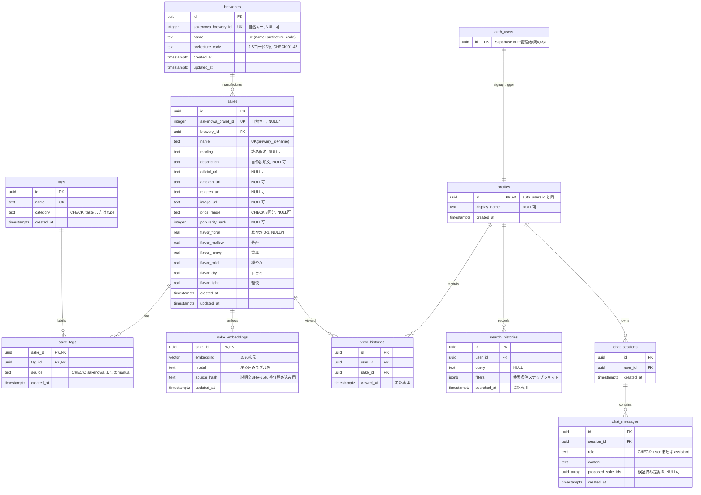

# DB設計書（DATABASE）— Jizake（日本酒レコメンドWebアプリ）

> 作成日: 2026-07-04
> 入力: `docs/REQUIREMENTS.md`（FR-01〜FR-08）／`docs/TECH_STACK.md`（Supabase Postgres + pgvector、Drizzle ORM）／
> `docs/philosophy/PLAN_PHILOSOPHY.md`（正規化優先）／`docs/DESIGN.md`（概念データモデル・決定記録 D1〜D8）／
> `docs/FEASIBILITY.md`（さけのわAPI仕様・価格帯区分）
> 前提: グリーンフィールド（既存スキーマなし）。自律実行モードのため、判断が必要な点は思想に沿って決定し、
> 理由を本書 §7（決定記録）に明記した。

---

## 1. 設計方針

### 1.1 正規化方針

**基本は第3正規形（3NF）を維持する。** PLAN_PHILOSOPHY のトレードオフ表「正規化 vs 読み取り性能 → 正規化」
に従う。データ件数は高々数千件であり、JOIN コストより整合性を優先する。

- タグは `tags` / `sake_tags` の多対多で正規化（FR-02 のタグ逆引きが JOIN で成立）。
- 都道府県は蔵元の属性（`breweries.prefecture_code`）。47件固定の JIS コードはアプリ内定数マスタとし、
  テーブルを作らない（DESIGN 決定 D2 を踏襲）。
- 履歴は追記専用のイベントログ。集計テーブル・非正規化キャッシュは持たない（DESIGN 決定 D6）。
- **意図的な非正規化は 2 箇所のみ**（理由は §7 の DB-5 / DB-6 に記録）:
  - `search_histories.filters`（jsonb）— 検索条件のスナップショット
  - `chat_messages.proposed_sake_ids`（uuid[]）— 検証済み提案IDのログ

### 1.2 命名規約

| 対象 | 規約 | 例 |
|---|---|---|
| テーブル名 | snake_case・複数形 | `sakes`, `view_histories` |
| カラム名 | snake_case・単数形 | `prefecture_code` |
| 外部キー | 参照先単数形 + `_id` | `brewery_id`, `user_id` |
| 中間テーブル | 両テーブル名の連結 | `sake_tags` |
| 文字列型 | `text` に統一（`varchar(n)` は使わない。長さ制限が必要な場合は CHECK で表現） | — |
| 日時型 | `timestamptz` に統一（UTC 保存、表示側で JST 変換） | `viewed_at` |
| インデックス名 | `{table}_{cols}_idx`（drizzle-kit 既定に合わせる） | `sakes_brewery_id_idx` |

### 1.3 ID戦略

**全テーブル UUID v4（`gen_random_uuid()` デフォルト）で統一する。**

- 理由: ID の規則が 1 つで済む（シンプルさ最優先）。`auth.users.id` が UUID であり、履歴系の FK と型が揃う。
  URL（`/sake/[id]`）で連番による総件数推測・列挙を避けられる。
- 連番（identity）とのランダム UUID の挿入性能差は、本規模（銘柄数千件・履歴も個人開発規模）では無視できる。
- **自然キーは別カラムの UNIQUE 制約で保持する**: さけのわ `brandId` / `breweryId` は
  `sakenowa_brand_id` / `sakenowa_brewery_id` に格納し UNIQUE を張る。インポートスクリプトは
  `ON CONFLICT (sakenowa_brand_id) DO UPDATE` による**冪等 upsert** を行う（FR-01 受け入れ条件）。
  手作業シード銘柄（さけのわ ID なし）は `UNIQUE (brewery_id, name)` を upsert キーにする。

### 1.4 Supabase auth.users との関係

- ユーザーの実体は Supabase Auth が管理する `auth.users`（パスワードハッシュ・セッションは委任）。
- `public.profiles` を **`auth.users` と 1:1 の公開スキーマ側アンカー**として置き、
  履歴系テーブルの FK はすべて `profiles.id` を参照する。理由:
  1. Drizzle が管理する `public` スキーマから Auth 内部スキーマ（`auth`）への直接 FK を避け、
     マイグレーションの管理境界を明確にする（Supabase 公式推奨パターン）。
  2. `auth.users` 削除時に `profiles` → 履歴・チャットへ `ON DELETE CASCADE` が連鎖し、
     退会時のユーザーデータ削除が DB 制約だけで完結する。
  3. 将来の表示名などユーザー属性の置き場になる。
- `profiles` 行はサインアップ時に `auth.users` への INSERT トリガで自動作成する（§2.5 に DDL）。
- DESIGN §2.3 は「プロフィールテーブルは初期不要（YAGNI）」としたが、上記 1・2 は機能ではなく
  **FK の物理的な足場**であり、物理設計の責務として最小構成（`id` + `display_name` + `created_at`）で追加する
  （決定 DB-1）。

### 1.5 マイグレーション・拡張機能

- スキーマは Drizzle スキーマ定義（`src/lib/db/schema.ts`）を単一情報源とし、drizzle-kit で生成した
  SQL マイグレーションを適用する。
- Drizzle で表現できないもの（`CREATE EXTENSION vector` / RLS ポリシー / `profiles` 自動作成トリガ /
  HNSW インデックス）は **カスタム SQL マイグレーション**としてマイグレーション列に含め、再現可能にする。
- 埋め込み次元は `vector(1536)`（text-embedding-3-small）。モデル差し替え時は次元が変わり得るため、
  カラム定義変更＋全再埋め込みのマイグレーションで対応する（`sake_embeddings.model` 列で対象判定）。

---

## 2. スキーマ定義

### 2.1 breweries（蔵元）

| カラム | 型 | NULL | デフォルト | 制約・説明 |
|---|---|---|---|---|
| id | uuid | NOT NULL | `gen_random_uuid()` | PK |
| sakenowa_brewery_id | integer | NULL | — | UNIQUE。さけのわ `breweryId`（自然キー）。手作業追加の蔵元は NULL |
| name | text | NOT NULL | — | 蔵元名 |
| prefecture_code | text | NOT NULL | — | JIS 都道府県コード2桁。CHECK `prefecture_code ~ '^(0[1-9]|[1-3][0-9]|4[0-7])$'` |
| created_at | timestamptz | NOT NULL | `now()` | — |
| updated_at | timestamptz | NOT NULL | `now()` | upsert 時にアプリ側で更新 |

テーブル制約:
- `UNIQUE (sakenowa_brewery_id)` — さけのわインポートの冪等 upsert キー（NULL は重複可）
- `UNIQUE (name, prefecture_code)` — 手作業シードの冪等 upsert キー兼、重複登録防止

### 2.2 sakes（日本酒）

| カラム | 型 | NULL | デフォルト | 制約・説明 |
|---|---|---|---|---|
| id | uuid | NOT NULL | `gen_random_uuid()` | PK。`/sake/[id]` の URL に使用 |
| sakenowa_brand_id | integer | NULL | — | UNIQUE。さけのわ `brandId`（自然キー）。手作業銘柄は NULL |
| brewery_id | uuid | NOT NULL | — | FK → `breweries.id`（ON DELETE RESTRICT。銘柄が残る限り蔵元は消せない） |
| name | text | NOT NULL | — | 銘柄名 |
| reading | text | NULL | — | 読み仮名（ひらがな）。ILIKE 検索の表記ゆれ対策。シードで段階整備（FEASIBILITY R8） |
| description | text | NULL | — | 自作説明文（著作権上さけのわからは取得不可）。RAG 埋め込みの原文 |
| official_url | text | NULL | — | 公式紹介ページ URL。NULL 時は UI 非表示（FR-03） |
| amazon_url | text | NULL | — | Amazon 購入リンク。NULL 時は UI が検索 URL（`/s?k=銘柄名`）を動的生成、または非表示 |
| rakuten_url | text | NULL | — | 楽天購入リンク。将来の楽天 API 連携用（FEASIBILITY §2.2 案B）。NULL 時は非表示 |
| image_url | text | NULL | — | 銘柄画像 URL（楽天市場 API から取得した楽天 CDN の商品画像。FR-09）。NULL 時は画像なし表示。自前保存はせず URL 参照のみ |
| price_range | text | NULL | — | 価格帯区分。CHECK `price_range IN ('under_1500', 'from_1500_to_3000', 'over_3000')`（FEASIBILITY §2.2 案C の3区分）。ベストエフォート項目 |
| popularity_rank | integer | NULL | — | さけのわ全国ランキング順位。CHECK `popularity_rank > 0`。推薦コールドスタートのフォールバックに使用 |
| flavor_floral | real | NULL | — | フレーバー6軸「華やか」。CHECK `0..1`（下記） |
| flavor_mellow | real | NULL | — | 「芳醇」 |
| flavor_heavy | real | NULL | — | 「重厚」 |
| flavor_mild | real | NULL | — | 「穏やか」 |
| flavor_dry | real | NULL | — | 「ドライ」 |
| flavor_light | real | NULL | — | 「軽快」 |
| created_at | timestamptz | NOT NULL | `now()` | — |
| updated_at | timestamptz | NOT NULL | `now()` | — |

テーブル制約:
- `UNIQUE (sakenowa_brand_id)` — インポートの冪等 upsert キー
- `UNIQUE (brewery_id, name)` — 手作業シードの upsert キー兼、同一蔵元内の重複銘柄防止
- `CHECK (flavor_floral BETWEEN 0 AND 1)` … 6軸それぞれに範囲 CHECK
- `CHECK (num_nulls(flavor_floral, flavor_mellow, flavor_heavy, flavor_mild, flavor_dry, flavor_light) IN (0, 6))`
  — 6軸は「全部ある」か「全部ない」かのどちらかのみ（さけのわ flavor-charts の提供単位と一致）

> フレーバー6軸は DESIGN の概念モデルでは `json flavorChart` だったが、**数値カラム6本に正規化**した。
> 理由は §7 決定 DB-4。

### 2.3 tags（タグ）

| カラム | 型 | NULL | デフォルト | 制約・説明 |
|---|---|---|---|---|
| id | uuid | NOT NULL | `gen_random_uuid()` | PK |
| name | text | NOT NULL | — | UNIQUE。例: `甘口`, `辛口`, `淡麗`, `純米大吟醸` |
| category | text | NOT NULL | — | CHECK `category IN ('taste', 'type')`。taste=味わい、type=種別（DESIGN の2カテゴリ） |
| created_at | timestamptz | NOT NULL | `now()` | — |

- `UNIQUE (name)` を全体で張る（カテゴリ跨ぎの同名タグは許さない）。検索 URL（`?tags=辛口`）や
  シードの upsert キーとしてタグ名が一意に解決できることを優先する。

### 2.4 sake_tags（日本酒⇔タグ 中間テーブル）

| カラム | 型 | NULL | デフォルト | 制約・説明 |
|---|---|---|---|---|
| sake_id | uuid | NOT NULL | — | PK の一部。FK → `sakes.id`（ON DELETE CASCADE） |
| tag_id | uuid | NOT NULL | — | PK の一部。FK → `tags.id`（ON DELETE CASCADE） |
| source | text | NOT NULL | — | CHECK `source IN ('sakenowa', 'manual')`。付与元の区別 |
| created_at | timestamptz | NOT NULL | `now()` | — |

テーブル制約:
- `PRIMARY KEY (sake_id, tag_id)` — 複合 PK。同一組み合わせの重複付与を禁止
- 再インポート時の運用: `import-sakenowa.ts` は `source = 'sakenowa'` の行のみ delete-insert（または upsert）し、
  `manual` 行には触れない。これにより手作業タグが機械再生成で消えない（DESIGN §3 の要件を制約と運用で担保）

### 2.5 profiles（プロフィール）

| カラム | 型 | NULL | デフォルト | 制約・説明 |
|---|---|---|---|---|
| id | uuid | NOT NULL | — | PK。FK → `auth.users.id`（ON DELETE CASCADE）。auth と同一 UUID |
| display_name | text | NULL | — | 表示名（初期 UI では未使用。将来用） |
| created_at | timestamptz | NOT NULL | `now()` | — |

サインアップ時の自動作成トリガ（カスタム SQL マイグレーション）:

```sql
create function public.handle_new_user()
returns trigger
language plpgsql
security definer set search_path = ''
as $$
begin
  insert into public.profiles (id) values (new.id);
  return new;
end;
$$;

create trigger on_auth_user_created
  after insert on auth.users
  for each row execute function public.handle_new_user();
```

### 2.6 view_histories（閲覧履歴）

| カラム | 型 | NULL | デフォルト | 制約・説明 |
|---|---|---|---|---|
| id | uuid | NOT NULL | `gen_random_uuid()` | PK |
| user_id | uuid | NOT NULL | — | FK → `profiles.id`（ON DELETE CASCADE） |
| sake_id | uuid | NOT NULL | — | FK → `sakes.id`（ON DELETE CASCADE） |
| viewed_at | timestamptz | NOT NULL | `now()` | 閲覧日時 |

- 追記専用（UPDATE / DELETE しない）。同一銘柄の複数回閲覧は複数行として記録する
  （閲覧頻度が嗜好シグナルであるため UNIQUE は張らない）。
- INSERT は Server Action `recordView` のみ。`user_id` はサーバ側で認証セッションから強制設定（DESIGN §6.2）。

### 2.7 search_histories（検索履歴）

| カラム | 型 | NULL | デフォルト | 制約・説明 |
|---|---|---|---|---|
| id | uuid | NOT NULL | `gen_random_uuid()` | PK |
| user_id | uuid | NOT NULL | — | FK → `profiles.id`（ON DELETE CASCADE） |
| query | text | NULL | — | 名前検索文字列。名前条件なしの検索では NULL |
| filters | jsonb | NOT NULL | `'{}'::jsonb` | 都道府県・タグ条件のスナップショット。形は Zod `SearchParams` と同一（例: `{"prefectureCode": "35", "tagNames": ["辛口"]}`） |
| searched_at | timestamptz | NOT NULL | `now()` | 検索実行日時 |

テーブル制約:
- `CHECK (query IS NOT NULL OR filters <> '{}'::jsonb)` — 条件が完全に空の「検索」は記録させない

- `filters` を jsonb にする理由は §7 決定 DB-5。0件ヒットの検索も記録する（「探したが無かった」も嗜好情報、DESIGN §4.1）。

### 2.8 chat_sessions（チャットセッション）

| カラム | 型 | NULL | デフォルト | 制約・説明 |
|---|---|---|---|---|
| id | uuid | NOT NULL | `gen_random_uuid()` | PK |
| user_id | uuid | NOT NULL | — | FK → `profiles.id`（ON DELETE CASCADE） |
| created_at | timestamptz | NOT NULL | `now()` | — |

- DESIGN 決定 D4 のとおり、**ログインユーザーが確定提案を受けた会話のみ**保存する（匿名チャットは保存しない）。
  したがって `user_id` は NOT NULL。

### 2.9 chat_messages（チャットメッセージ）

| カラム | 型 | NULL | デフォルト | 制約・説明 |
|---|---|---|---|---|
| id | uuid | NOT NULL | `gen_random_uuid()` | PK |
| session_id | uuid | NOT NULL | — | FK → `chat_sessions.id`（ON DELETE CASCADE） |
| role | text | NOT NULL | — | CHECK `role IN ('user', 'assistant')` |
| content | text | NOT NULL | — | メッセージ本文（プレーンテキスト） |
| proposed_sake_ids | uuid[] | NULL | — | **DB 存在検証済み**の提案銘柄 ID 配列。提案を含む assistant メッセージのみ非 NULL |
| created_at | timestamptz | NOT NULL | `now()` | — |

テーブル制約:
- `CHECK (proposed_sake_ids IS NULL OR role = 'assistant')` — 提案 ID は assistant メッセージにのみ付く

- `proposed_sake_ids` を FK 付き別テーブルにしない理由は §7 決定 DB-6。

### 2.10 sake_embeddings（埋め込み）

| カラム | 型 | NULL | デフォルト | 制約・説明 |
|---|---|---|---|---|
| sake_id | uuid | NOT NULL | — | PK。FK → `sakes.id`（ON DELETE CASCADE）。銘柄と 1:0..1 |
| embedding | vector(1536) | NOT NULL | — | 説明文の埋め込み（text-embedding-3-small） |
| model | text | NOT NULL | — | 埋め込みモデル名。AI Gateway の provider/model 形式で記録（例: `openai/text-embedding-3-small`）。モデル差し替え時の再生成対象判定 |
| source_hash | text | NOT NULL | — | 説明文の SHA-256 ハッシュ（hex）。`embed.ts` が現行 description のハッシュと比較し、**変更行のみ差分再埋め込み** |
| updated_at | timestamptz | NOT NULL | `now()` | 埋め込み生成日時 |

- `sakes` から分離する理由（DESIGN §3 を踏襲）: 説明文がある銘柄のみ存在し、モデル差し替えで全再生成という
  本体と異なるライフサイクルを持つため。
- 前提: `create extension if not exists vector;`（カスタム SQL マイグレーション）。

---

## 3. インデックス設計

要件の検索・結合・ソートパターンから逆算して張る。書き込みは「バッチ upsert」と「履歴 INSERT」のみで
頻度が低いため、以下のインデックスの書き込みコストは問題にならない。**先回りのインデックスは張らない**
（シンプルさ最優先。劣化を計測してから追加する）。

| # | インデックス | 対象クエリ（検索パターン） |
|---|---|---|
| 1 | `breweries_prefecture_code_idx` on `breweries (prefecture_code)` | FR-07 都道府県→地酒一覧、FR-06 都道府県条件（蔵元 JOIN の絞り込み側） |
| 2 | `sakes_brewery_id_idx` on `sakes (brewery_id)` | 蔵元 JOIN（県別一覧・詳細ページ・検索の県条件） |
| 3 | `sakes_popularity_rank_idx` on `sakes (popularity_rank)` `WHERE popularity_rank IS NOT NULL`（部分インデックス） | 推薦コールドスタートのフォールバック（人気順上位の取得）。NULL 行を除外して最小化 |
| 4 | `sake_tags_tag_id_idx` on `sake_tags (tag_id)` | FR-02 タグ→日本酒の逆引き、FR-06 タグ絞り込み（EXISTS）。sake_id 起点は複合 PK が兼ねる |
| 5 | `view_histories_user_id_viewed_at_idx` on `view_histories (user_id, viewed_at DESC)` | 履歴一覧表示・推薦の「直近 N 件」集計（user_id 等値 + 時系列降順） |
| 6 | `view_histories_sake_id_idx` on `view_histories (sake_id)` | 銘柄削除時の CASCADE 走査、将来の銘柄別閲覧数集計 |
| 7 | `search_histories_user_id_searched_at_idx` on `search_histories (user_id, searched_at DESC)` | 同上（検索履歴） |
| 8 | `chat_sessions_user_id_created_at_idx` on `chat_sessions (user_id, created_at DESC)` | 本人のセッション一覧、1日あたりチャット回数カウント（DESIGN §6.3 レート制限） |
| 9 | `chat_messages_session_id_created_at_idx` on `chat_messages (session_id, created_at)` | セッション内メッセージの時系列取得 |
| 10 | `sake_embeddings_embedding_idx` — `USING hnsw (embedding vector_cosine_ops)` | RAG retriever のコサイン類似度検索（`embedding <=> $query` の ORDER BY） |

補足:

- **UNIQUE 制約の暗黙インデックス**（`sakenowa_brand_id`・`sakenowa_brewery_id`・`(brewery_id, name)`・
  `(name, prefecture_code)`・`tags(name)`）が upsert の競合判定とタグ名検索を兼ねるため、重複して張らない。
- **名前 ILIKE（`%…%` 中間一致）には初期はインデックスを張らない。** btree は中間一致に効かず、数千件の
  seq scan で「2秒以内」要件を大きく下回るため（TECH_STACK §6）。劣化時の第一拡張は
  `create extension pg_trgm` ＋ `gin (name gin_trgm_ops)` / `gin (reading gin_trgm_ops)` の追加のみで、
  アプリの検索関数シグネチャは変えない。
- **pgvector は HNSW を採用**（IVFFlat ではなく）。IVFFlat はデータ投入後の学習（lists 設定と再構築）が必要で、
  バッチ再投入のたびに再作成の考慮が要る。HNSW はデータ量に依存せず作成でき、リコールも優位。
  数千件規模では index なしの全走査でも十分速いが、パラメータ既定値（`m=16, ef_construction=64`）で
  張っておけば運用判断が不要になる（マネージド・運用ゼロ志向）。距離は埋め込みの慣例どおりコサイン
  （`vector_cosine_ops`）で統一し、retriever も `<=>` 演算子を使う。

---

## 4. RLS ポリシー方針

### 4.1 前提: 二段構えの防御（DESIGN §6.2 の確定事項）

**主防御はサーバ側フィルタである。** Drizzle のサーバ接続（コネクションプーラ経由の `postgres` ロール）は
RLS を素通しするため、RLS はアプリの主アクセス制御にならない。

1. **一段目（主防御）**: サーバ側クエリ関数は `user_id` を引数で受け取らず、必ず認証セッションから取得して
   WHERE に適用する（呼び出し側が他人の ID を渡せない構造）。
2. **二段目（defense-in-depth・本節）**: 全テーブルで RLS を有効化し、anon キー経由
   （PostgREST / supabase-js）のアクセスを最小権限に制限する。将来クライアントから supabase-js で
   直接読む実装が紛れ込んでも、他人の履歴は構造的に読めない。

### 4.2 ポリシー一覧

全テーブルで `alter table … enable row level security;` を実行した上で、以下のポリシーのみ定義する。
**ポリシーが無い操作はデフォルト拒否**であることを利用し、書き込み系ポリシーは意図的に作らない
（書き込みはすべて RLS を素通しするサーバ接続＝Server Actions / バッチ経由のため、anon キーからの
書き込みは全テーブルで拒否される）。

| テーブル | ポリシー | 対象ロール | 定義 |
|---|---|---|---|
| breweries / sakes / tags / sake_tags | 公開読み取り | anon, authenticated | `for select using (true)` — カタログは未ログインでも閲覧可（FR-04・思想「未ログインでも価値」） |
| sake_embeddings | **ポリシーなし（全拒否）** | — | 埋め込みはサーバ側 retriever 専用。クライアントに公開する理由がない |
| profiles | 本人のみ読み取り | authenticated | `for select using ((select auth.uid()) = id)` |
| view_histories | 本人のみ読み取り | authenticated | `for select using ((select auth.uid()) = user_id)` |
| search_histories | 本人のみ読み取り | authenticated | `for select using ((select auth.uid()) = user_id)` |
| chat_sessions | 本人のみ読み取り | authenticated | `for select using ((select auth.uid()) = user_id)` |
| chat_messages | 本人のみ読み取り | authenticated | `for select using (exists (select 1 from chat_sessions s where s.id = session_id and s.user_id = (select auth.uid())))` |

補足:

- `auth.uid()` は `(select auth.uid())` 形式で書く（行ごとの再評価を避ける Supabase 推奨の initPlan 化）。
- 非機能要件「履歴は本人のみ参照可能」はこの表の下 4 行＋一段目のサーバ側フィルタで満たす。
- RLS ポリシー DDL は drizzle-kit 管理外のカスタム SQL マイグレーションとしてリポジトリに置き、
  再実行可能な手順に含める。

---

## 5. ER図



---

## 6. 受け入れ条件との対応確認

REQUIREMENTS.md のデータ関連受け入れ条件が本スキーマで満たせることの確認表。

| FR | 受け入れ条件（データ関連） | スキーマでの担保 |
|---|---|---|
| FR-01 | 日本酒データが DB に格納され、一覧・詳細で取得できる | `sakes`（名称・説明）＋ `breweries`（蔵元・都道府県）。必須項目のうち name / brewery / prefecture は NOT NULL、description は NULL 可（段階整備、FEASIBILITY の期待値調整どおり） |
| FR-01 | データ投入が再実行可能 | `UNIQUE (sakenowa_brand_id)` / `UNIQUE (sakenowa_brewery_id)` / `UNIQUE (brewery_id, name)` / `UNIQUE (tags.name)` を `ON CONFLICT` の競合キーとした冪等 upsert が成立 |
| FR-02 | 詳細でタグ一覧表示・タグで絞り込み | `sake_tags` の多対多。逆引きは `sake_tags_tag_id_idx` で索引化。`source` 列で再インポート時に手作業タグを保全 |
| FR-03 | 詳細ページの説明・タグ・外部リンク・価格帯 | `description` / `official_url` / `amazon_url` / `rakuten_url` / `price_range`（CHECK 付き3区分）。全て NULL 可＝「無い場合は非表示」がそのまま表現できる |
| FR-09 | 銘柄画像の表示（ベストエフォート） | `image_url`（NULL 可）。楽天市場 API 由来の画像 URL を参照。NULL＝画像なし表示 |
| FR-04 | サインアップ／ログイン、履歴のユーザー紐付け | `auth.users`（Supabase Auth）→ `profiles`（トリガで 1:1 自動作成）→ 履歴系 FK。退会時は CASCADE で全ユーザーデータ削除 |
| FR-05 | 詳細閲覧・検索実行が履歴として記録される | `view_histories` / `search_histories`（追記専用、`filters` に検索条件を再現可能な形で保存） |
| FR-05 | 履歴に基づくおすすめ（無履歴時フォールバック） | 履歴 →（JOIN: sakes / sake_tags / breweries）→ タグ・都道府県頻度集計が index 5・7 で高速に引ける。フォールバックは `popularity_rank`（部分インデックス 3） |
| FR-06 | 名前・都道府県・味の複合検索 | 名前: `name ILIKE` + `reading ILIKE`。都道府県: `breweries.prefecture_code`（index 1・2）。味: `sake_tags` EXISTS（index 4）。AND 結合可能 |
| FR-07 | 都道府県選択→地酒一覧 | `breweries.prefecture_code`（CHECK で JIS コード保証）→ `sakes` JOIN |
| FR-08 | 提案は DB 実在の銘柄のみ・詳細リンクを持つ | retriever は `sakes` + `sake_embeddings`（HNSW）+ タグ SQL のハイブリッド検索で実在 ID のみ返す。確定提案は `chat_messages.proposed_sake_ids` に**検証済み ID のみ**保存（CHECK で assistant 限定） |
| 非機能 | 履歴は本人のみ参照可能 | サーバ側 user_id 強制フィルタ（主防御）＋ RLS 本人限定 SELECT ポリシー（§4） |
| 非機能 | 検索・一覧 2 秒以内 | 数千件規模＋ §3 のインデックス。ILIKE 劣化時は pg_trgm GIN を追加（スキーマ変更不要） |

---

## 7. 決定記録（物理設計での判断）

| # | 決定 | 採用 | 却下案 | 理由 |
|---|---|---|---|---|
| DB-1 | profiles テーブルの追加 | 最小構成で追加 | auth.users へ直接 FK（DESIGN §2.3 の YAGNI） | 機能追加ではなく FK の物理的な足場。Drizzle 管理下の public スキーマから auth スキーマへの FK を避け、退会時の CASCADE 削除を DB 制約で完結させる（§1.4）。Supabase 公式推奨パターンに従う |
| DB-2 | ID 戦略 | 全テーブル UUID | 履歴系のみ bigint identity | 規則が 1 つで済むシンプルさを優先。auth.users と型が揃い、本規模で性能差は無視できる |
| DB-3 | 価格帯の表現 | text + CHECK（3区分） | 数値カラム（min/max 円）／Postgres enum | FEASIBILITY §2.2 案C の手動区分をそのまま表現。enum 型は区分追加が `ALTER TYPE` になり Drizzle マイグレーションが煩雑。CHECK なら制約差し替えのみ |
| DB-4 | フレーバー6軸 | real カラム 6 本＋範囲 CHECK＋全有無 CHECK | jsonb（DESIGN 概念モデル案） | 正規化優先の思想どおり。型・範囲を制約で保証でき、味タグへの機械変換（しきい値判定）や将来の推薦スコアリングを SQL で直接書ける。軸数は さけのわ仕様で固定 |
| DB-5 | 検索条件の保存 | `search_histories.filters` jsonb | 条件を正規化した子テーブル | 検索条件は「その時点のイベントのスナップショット」であり、行として結合・更新する対象ではない。読み手は推薦ロジック（アプリ側で Zod パース）のみ。正規化はテーブル 2 枚と JOIN を増やすだけ。**正規化優先からの意図的逸脱として記録** |
| DB-6 | 提案銘柄 ID の保存 | `chat_messages.proposed_sake_ids` uuid[] | `chat_proposals` 中間テーブル（FK 付き） | 書き込み時に DB 存在検証済み（DESIGN の捏造防止二段構え）の確定ログであり、参照整合性を FK で維持し続ける必要がない（過去ログ中の銘柄が削除されても表示時に再検証する）。中間テーブルはこの用途に対して過剰。**意図的逸脱として記録** |
| DB-7 | pgvector インデックス | HNSW（cosine） | IVFFlat／インデックスなし | IVFFlat は投入後の再構築運用が必要。HNSW は既定値で張りきりにでき運用判断が不要（運用ゼロ志向）。数千件では無くても速いが、張るコストも無視できる |
| DB-8 | 名前検索インデックス | 初期は張らない | pg_trgm GIN を最初から | 中間一致 ILIKE に btree は無効。数千件の seq scan で性能要件を満たすため、計測してから pg_trgm を追加（TECH_STACK 決定 3 を踏襲、先回りしない） |
| DB-9 | RLS の書き込みポリシー | 作らない（デフォルト拒否を利用） | 本人 INSERT を許可するポリシー | 書き込み経路はサーバ（Server Actions・バッチ）のみで、これらは RLS を素通しする。anon キーからの書き込みを全拒否する方が攻撃面が小さく、ポリシー数も最小 |
| DB-10 | タグ名の一意性 | `UNIQUE (name)` 全体 | `UNIQUE (category, name)` | タグ名が URL パラメータ・シード upsert キーとして単独で解決できる方がシンプル。カテゴリ跨ぎの同名タグ（例: 味わいと種別の両方に「辛口」）は実データ上想定されない |

---

## 8. DESIGN 概念モデルからの差分一覧

実装時の突き合わせ用に、DESIGN §3 の概念モデルからの変更点をまとめる。

| 概念モデル | 本書（物理設計） | 対応する決定 |
|---|---|---|
| `User`（auth.users 直接参照） | `profiles` を挟む | DB-1 |
| `Sake.flavorChart` json | `flavor_*` real × 6 カラム | DB-4 |
| `ChatMessage.proposedSakeIds` json | `uuid[]` 型＋assistant 限定 CHECK | DB-6 |
| 外部リンクは `officialUrl` のみ | `amazon_url` / `rakuten_url` を追加（NULL 可） | FR-03 の購入リンクを列として保持。NULL 時は UI が検索リンク生成 or 非表示 |
| （記載なし） | `UNIQUE (brewery_id, name)`・`UNIQUE (name, prefecture_code)` | 手作業シードの冪等 upsert キー（§1.3） |
