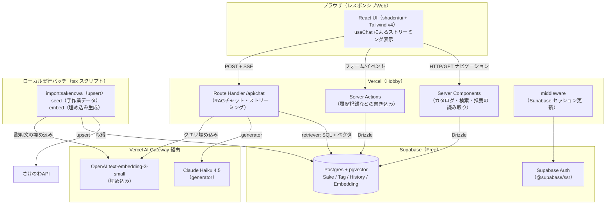
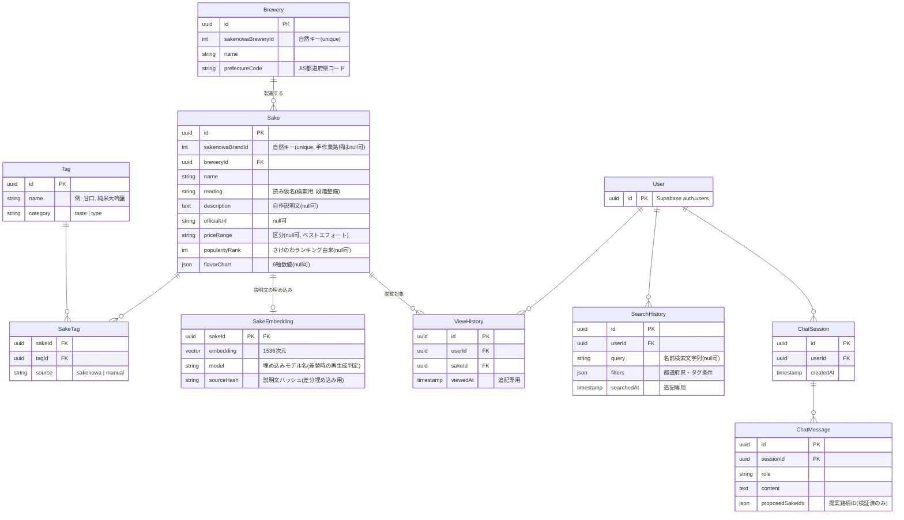
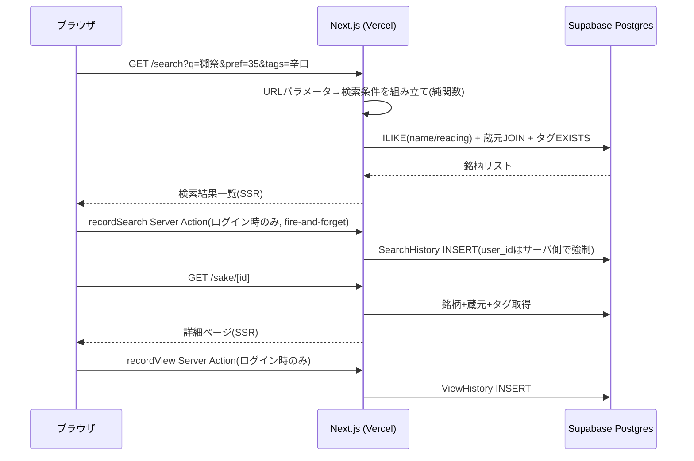
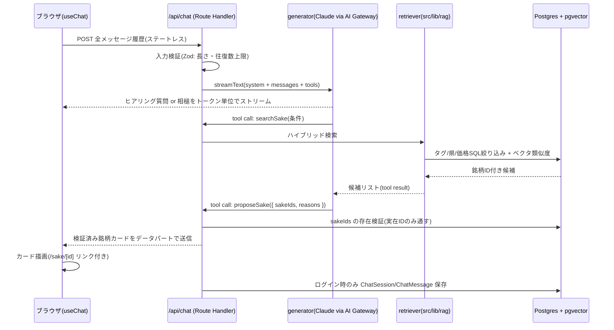

# 設計書（DESIGN）— Jizake（日本酒レコメンドWebアプリ）

> 作成日: 2026-07-04
> 入力: `docs/REQUIREMENTS.md`（FR-01〜FR-08）／`docs/philosophy/PLAN_PHILOSOPHY.md`／
> `docs/philosophy/CODING_PHILOSOPHY.md`／`docs/FEASIBILITY.md`／`docs/TECH_STACK.md`
> 前提: グリーンフィールド。自律実行モードのため、判断が必要な点は思想に沿って決定し、理由を本書に明記した。

---

## 1. アーキテクチャ概要

### 1.1 全体構成

Next.js（App Router）を Vercel にデプロイし、データ・ベクタ・認証を Supabase に集約した
サーバレス 3 層構成。自前運用のサーバー・常駐プロセスは持たない（思想: マネージド優先・運用ゼロ志向）。



### 1.2 設計の骨格（思想との対応）

| 思想 | 本設計での反映 |
|---|---|
| データ中心設計 | 検索・推薦・RAG はすべて「Postgres 上の日本酒データを異なる方法で引く」読み取り系機能。書き込みは履歴記録とバッチ投入のみ |
| 差し替え可能な知能 | 推薦は `Recommender` インターフェース（入力=履歴、出力=銘柄リスト）で固定。RAG は retriever / generator を分離し、LLM・埋め込みは AI Gateway のモデルID変更で交換可能 |
| シンプルさ最優先 | Route Handler は `/api/chat` の 1 本のみ。他はすべて Server Components / Server Actions で完結。独自レイヤーを発明しない |
| 未ログインでも価値がある | 閲覧・検索・チャットは匿名可。認証は履歴記録・パーソナライズ推薦のみのゲート |

### 1.3 依存方向

```
UI（Client/Server Components）
  → 機能ロジック（検索クエリ組み立て・推薦スコアリング・retriever）
    → データアクセス（Drizzle クエリ関数）／外部アダプタ（AI SDK 経由の LLM・埋め込み）
```

- 逆流禁止。データアクセス層・アダプタ層は UI の型を知らない。
- ベンダー型（AI SDK のメッセージ型、supabase-js のセッション型など）は境界（アダプタ・auth ヘルパ）で
  アプリ内の型に変換し、機能ロジックへ漏らさない。
- 推薦・RAG・検索は互いに依存せず、共通のカタログデータアクセスにのみ依存する。

### 1.4 ディレクトリ構成（方針）

Next.js の規約とコロケーション原則（CODING_PHILOSOPHY）に従う。機能専用のコードはルートセグメント配下の
プライベートフォルダ（`_components` / `_lib`）に置き、横断利用が確定したものだけ `src/lib` に昇格させる。

```
src/
  app/
    page.tsx                 # ホーム（おすすめ表示）
    search/                  # 検索（URLパラメータ駆動）
    prefectures/[code]/      # 都道府県別地酒
    sake/[id]/               # 詳細ページ
    chat/                    # RAGチャット UI
    login/  signup/          # 認証画面
    history/                 # 閲覧・検索履歴（要ログイン）
    api/chat/route.ts        # チャット Route Handler（唯一のAPIルート）
  lib/
    db/                      # Drizzle スキーマ・クライアント・共有クエリ
    auth/                    # @supabase/ssr ヘルパ（サーバ/クライアント別）
    ai/                      # LLM・埋め込みアダプタ（AI SDK 呼び出しを集約）
    recommend/               # Recommender IF + ルールベース実装
    rag/                     # retriever（ハイブリッド検索）・捏造防止ID検証
  middleware.ts              # セッション更新
scripts/
  import-sakenowa.ts         # さけのわ取り込み（冪等 upsert）
  seed.ts                    # 手作業シード投入
  embed.ts                   # 説明文の埋め込み生成（差分）
seed-data/                   # 説明文・種別・読み仮名・価格帯の JSON/TS（レビュー可能）
```

`recommend` / `rag` / `ai` は複数画面・バッチから使うため最初から `src/lib` に置く（コロケーション原則の
「横断利用が確定したもの」に該当）。

---

## 2. コンポーネント分割と責務

### 2.1 日本酒カタログ（一覧・詳細・都道府県別）

| 項目 | 内容 |
|---|---|
| 責務 | 銘柄・蔵元・タグの読み取り表示。`/sake/[id]` 詳細、`/prefectures/[code]` 県別一覧 |
| 実装 | Server Components が Drizzle クエリ関数を直接呼ぶ。公開データのみで認証不要 |
| 詳細ページ表示 | 説明文・タグ一覧・公式リンク・Amazon 検索リンク（`https://www.amazon.co.jp/s?k=銘柄名` の静的生成）・価格帯。リンク欠損時は非表示、外部リンクは `target="_blank" rel="noopener"`（FR-03） |
| キャッシュ | カタログは更新頻度が低い（バッチ投入時のみ）ため、詳細・県別一覧は時間ベースの再検証（例: `revalidate = 3600`）で静的寄りに配信 |

### 2.2 検索

| 項目 | 内容 |
|---|---|
| 責務 | 名前（部分一致）× 都道府県 × 味タグの複合検索（FR-06） |
| 実装 | 検索条件は **URL クエリパラメータ**（`/search?q=&pref=&tags=`）で表現し、Server Component が読み取って検索実行。共有可能な URL・ブラウザバック対応・SSR を一挙に満たす |
| クエリ | 名前: `name ILIKE` ＋ `reading ILIKE`（読み仮名列、表記ゆれ対策）。都道府県: 蔵元 JOIN。味: タグ JOIN の EXISTS。複合は AND 結合 |
| 検索条件の組み立て | URL⇔条件の純関数として分離（ユニットテスト対象、TEST_PHILOSOPHY）。T15 で `src/lib/search-query/` へ昇格（検索・履歴・チャット fallback の 3 機能共用。DIR-11） |
| 0件時 | 空状態メッセージ＋条件緩和の導線（タグを外すリンク） |
| 拡張パス | 遅くなったら pg_trgm の GIN インデックスを追加。検索関数のシグネチャは変えない |

### 2.3 認証

| 項目 | 内容 |
|---|---|
| 責務 | サインアップ・ログイン・ログアウト・セッション維持（FR-04） |
| 実装 | Supabase Auth（メール＋パスワード）。`@supabase/ssr` の標準パターンに従い、サーバ用・クライアント用のクライアント生成ヘルパを `src/lib/auth` に置く |
| middleware | 全リクエストでセッショントークンを更新（`updateSession`）。`/history` は未ログイン時に `/login?next=/history` へリダイレクト |
| ゲート方針 | ルート保護は `/history` のみ。ホームの推薦枠は「未ログイン→人気銘柄＋ログイン誘導、ログイン済み→パーソナライズ」と同一ページ内で出し分ける（思想: 認証を機能のゲートにしない） |
| ユーザーID | `auth.users.id`（UUID）をそのまま履歴テーブルの外部キーに使う。プロフィールテーブルは初期不要（YAGNI） |

### 2.4 履歴記録

| 項目 | 内容 |
|---|---|
| 責務 | 閲覧履歴・検索履歴の記録と本人による参照（FR-05 前半） |
| 記録方式 | **Server Actions**（`recordView(sakeId)` / `recordSearch(params)`）。詳細ページ・検索結果ページに置いた小さな Client Component がマウント時に fire-and-forget で呼ぶ。未ログイン時はサーバ側で no-op |
| RSC 内で記録しない理由 | レンダリング中の副作用はプリフェッチ・キャッシュ・ボットで多重記録されるため。Server Action ならユーザーの実閲覧に紐づく |
| データ形式 | 追記専用のイベントログ（更新・削除しない）。将来の協調フィルタリングへの拡張余地を担保（REQUIREMENTS 前提） |
| アクセス制御 | 「サーバ側で必ず `user_id = 現在のユーザー` をフィルタ」＋「RLS で本人のみ許可」の二段構え（§6.2） |

### 2.5 推薦エンジン

| 項目 | 内容 |
|---|---|
| 責務 | 履歴から嗜好を推定し、おすすめ銘柄リストを返す（FR-05 後半） |
| 固定インターフェース | `recommend(input: { userId: string \| null; limit: number }): Promise<RecommendedSake[]>`。`RecommendedSake = { sake: SakeSummary; reason: RecommendReason }`。**入出力のみ固定し、実装は差し替え可能**（思想: 差し替え可能な知能） |
| 初期実装（ルールベース） | ①直近の閲覧・検索履歴から関連タグ＋都道府県の出現頻度を集計（時間減衰係数つき）②未閲覧銘柄をタグ一致度でスコアリング ③上位 N 件を返す。**複数クエリ（履歴集計・候補絞り込み・タグ一括取得・人気補完）＋スコア計算の純関数**で実装（スコア重みは定数化）。当初案の「単一の集計 SQL」から複数クエリに分割したのは、既存の `selectTagsBySakeIds`（N+1 回避のタグ一括取得）を再利用し、候補を SQL で事前絞り込み（母集団上限つき）できるため（T10 実装。REVIEW T10 PHIL S-1） |
| コールドスタート | 履歴がしきい値未満（定数、初期値 3 件）なら人気銘柄（さけのわランキング由来の `popularity_rank`）にランダム性を加えて返す。`userId: null`（未ログイン）も同じフォールバックに落ちる |
| 呼び出し | ホームの Server Component から直接呼ぶ。オンデマンド計算で事前バッチ・キャッシュは持たない（数千件規模では不要。リアルタイム性よりコスト優先の思想どおり） |
| 将来拡張 | 協調フィルタリング等はこの IF の別実装として追加。呼び出し側は変更不要 |

### 2.6 RAG チャットボット

| 項目 | 内容 |
|---|---|
| 責務 | Q&A ヒアリング→DB 内の銘柄を複数提案（FR-08）。**retriever と generator を分離** |
| retriever（`src/lib/rag`） | ハイブリッド検索: タグ・都道府県・価格帯の SQL 絞り込み ＋ pgvector コサイン類似度（クエリ埋め込みは text-embedding-3-small）。入力=検索条件＋自然文、出力=銘柄ID付き候補リスト。**LLM に依存しない**ため単体で統合テスト可能（TEST_PHILOSOPHY） |
| generator | AI SDK `streamText`（AI Gateway 経由の Claude Haiku 4.5）。システムプロンプトで「ヒアリング（2〜3問）→検索→提案」の進行と、ツールの検索結果にある銘柄のみ提案することを指示 |
| ツール定義 | ① `searchSake`: LLM がヒアリング回答を検索条件に変換して retriever を呼ぶ ② `proposeSake`: 提案確定時に **structured output（Zod スキーマ）で銘柄IDの配列＋提案理由**を返させる |
| 捏造防止（二段構え） | (1) プロンプトに渡す候補は retriever の結果（DB 実在ID付き）のみ (2) `proposeSake` が返した ID を**サーバ側で DB 存在検証**し、実在する銘柄だけをカードデータとしてストリームに載せる。実在しない ID は黙って除外。**LLM の自由文をカードにしない**ため、ハルシネーション表示は構造的に不可能 |
| UI | `useChat` によるストリーミング表示。提案カードはストリームのデータパートから描画し、`/sake/[id]` へのリンクを持つ（FR-08 受け入れ条件） |
| セッション | 会話状態はクライアント側（useChat のメッセージ配列）で保持し、リクエストごとに全履歴を送る**ステートレス設計**。ログインユーザーの確定提案のみ `ChatSession` / `ChatMessage` に保存（推薦の入力・振り返り用）。§8 の判断 D4 参照 |

### 2.7 データインポート

| 項目 | 内容 |
|---|---|
| 責務 | さけのわ API 取り込み＋手作業シードのハイブリッド投入（FR-01、FEASIBILITY §1.4） |
| `import-sakenowa.ts` | areas / brands / breweries / rankings / flavor-charts / brand-flavor-tags を取得し、**さけのわ brandId を自然キーに冪等 upsert**。フレーバーチャート6軸をしきい値（定数）で味タグ（華やか/芳醇/重厚/穏やか/ドライ/軽快）へ機械変換 |
| `seed.ts` | `seed-data/` の JSON/TS（説明文・種別タグ・読み仮名・公式URL・価格帯区分）を upsert。説明文は必ず自作（著作権、FEASIBILITY R2） |
| `embed.ts` | 説明文を持つ銘柄の埋め込みを生成し `SakeEmbedding` へ upsert。埋め込み対象テキスト（銘柄名＋蔵元＋都道府県＋説明文＋タグ）の **SHA-256 ハッシュを `source_hash` に保存し、ハッシュか `model` が変わった銘柄のみ差分再埋め込み**（コスト最小化。T11 実装。当初「説明文のハッシュ」を、実際の埋め込み対象テキスト＝差分基準に統一した） |
| 実行 | ローカル手動実行（`npm run import:sakenowa` 等）。API 直参照はせずスナップショット化（さけのわ提供終了リスクの遮断） |
| 帰属表示 | 全ページ共通フッターに「さけのわデータを利用しています」＋ https://sakenowa.com リンクを常設（利用条件） |

---

## 3. 概念データモデル

詳細スキーマ（型・制約・インデックス）は DB 設計フェーズに委ね、ここではエンティティと関係のみ定める。



**モデル上の設計判断**

- **都道府県は蔵元の属性**（`Brewery.prefectureCode`）とし、タグにしない。47 件固定の JIS コードで
  アプリ内定数マスタとして持つ（テーブル不要）。検索・県別表示は蔵元 JOIN で引く。
  推薦スコアリングでは都道府県を「擬似タグ」として頻度集計に混ぜる（ロジック側の扱いであり、モデルは正規化を保つ）。
- **タグは taste（味わい）/ type（種別）の 2 カテゴリ**から始める。`source` 列でさけのわ機械生成と
  手作業付与を区別し、再インポート時に手作業タグを上書きしない。
- **履歴は追記専用のイベントログ**。集計はクエリ時に行い、集計済みテーブルを持たない（正規化優先の思想、
  数千件規模で十分速い）。
- **SakeEmbedding を Sake から分離**する理由: 埋め込みは説明文がある銘柄のみ・モデル差し替えで全再生成があり、
  ライフサイクルが本体と異なるため。`model` 列で埋め込みモデル変更時の再生成対象を判定できる。

---

## 4. 主要処理フロー

### 4.1 検索 → 一覧 → 詳細 → 履歴記録



- 0 件時は一覧の代わりに空状態を表示（履歴は記録する。「探したが無かった」も嗜好情報）。
- 履歴記録の失敗はページ表示に影響させない（fire-and-forget、エラーはログのみ）。

### 4.2 推薦生成（ホーム表示）

1. ホームの Server Component が `recommend({ userId, limit })` を呼ぶ（未ログインは `userId: null`）。
2. `userId` が null、または履歴件数がしきい値未満 → **フォールバック**: `popularity_rank` 上位からランダム性を
   加えて `limit` 件返す（reason: "人気の銘柄"）。
3. 履歴が十分ある場合:
   a. 直近の ViewHistory（閲覧銘柄のタグ・都道府県）と SearchHistory（filters 内のタグ・都道府県）を集計し、
      時間減衰係数を掛けた頻度スコア（嗜好プロファイル）を作る（履歴取得＋タグ一括取得のクエリ＋純関数集計。
      当初案の「1 本の集計 SQL」から複数クエリに分割。§2.5 参照）。
   b. 未閲覧銘柄（全期間の閲覧済みを除外）を対象に、母集団上限つきで候補を SQL 絞り込みし、
      タグ一致度 × 頻度スコアで並べ替え、上位 `limit` 件を返す
      （reason: "よく見ている『辛口』『山口県』から" のような根拠タグ付き）。件数不足は人気銘柄で補完する。
4. UI は `RecommendedSake[]` を推薦カード列として描画。reason を表示して推薦の透明性を確保する。

### 4.3 RAG チャット 1 往復



- ヒアリング（数問）は generator のシステムプロンプトで制御し、アプリ側に状態機械を持たない（シンプルさ優先）。
- 会話の往復数上限・メッセージ長上限は定数化し、超過時は「検索ページへの誘導」を返す（コスト上限、§6.3）。

---

## 5. API／インターフェース設計

### 5.1 使い分けの原則

| 手段 | 用途 | 本アプリでの対象 |
|---|---|---|
| **Server Components** | 読み取り全般。fetch API を挟まず Drizzle クエリ関数を直接呼ぶ | カタログ・検索・県別・推薦・履歴一覧 |
| **Server Actions** | ユーザー操作起点の書き込み（mutation） | `recordView` / `recordSearch`、（ログアウト等の auth 操作） |
| **Route Handlers** | ストリーミング・外部からの呼び出しなど、上記で表現できないもののみ | `/api/chat`（唯一。ストリーミング応答のため） |

一覧・詳細取得の REST API は**作らない**。RSC からの直接クエリが Next.js の規約であり、
API 層を挟むのは構成要素を増やすだけ（思想: 規約優先・シンプルさ）。
FR-01 受け入れ条件の「一覧・詳細 API で取得できる」は「サーバ側データ取得関数＋ページとして取得できる」と解釈する。

### 5.2 境界の型と検証（CODING_PHILOSOPHY「型は境界で厳格に」）

| 境界 | 検証方法 |
|---|---|
| URL 検索パラメータ | Zod でパースし `SearchParams` 型に正規化（不正値は無視してデフォルトへ） |
| Server Actions 入力 | Zod で検証（クライアントからの入力は信用しない） |
| `/api/chat` リクエスト | Zod（メッセージ配列・長さ・往復数） |
| LLM structured output | `proposeSake` ツールの Zod スキーマ＋**DB 存在検証**（スキーマ適合でも実在しない ID は落とす） |
| DB | Drizzle スキーマから型を導出（単一情報源） |
| さけのわ API レスポンス | インポートスクリプト内で Zod 検証（API 仕様変更の早期検知） |

### 5.3 主要インターフェース（シグネチャ）

```ts
// 検索（URL⇔条件の純関数は src/lib/search-query〔T15 昇格〕、クエリは src/lib/db/queries/sakes.ts）
// 実装では SakeSummary/タグ一括取得を県別一覧と共有するためクエリを db/queries に集約し、
// タグは tagIds ではなく tagNames（URL 設計 ?tags=辛口・DATABASE §2.7 の filters と統一）、
// 返り値は総件数つき SearchSakesPage（ページャ）に変更（T07 実装。CODE レビュー S-3）。
searchSakes(db, query: SakeSearchQuery): Promise<SearchSakesPage>
// SakeSearchQuery = { q?: string; prefectureCode?: string; tagNames: string[]; page: number }

// 推薦（src/lib/recommend）— 実装差し替え可能な固定IF
recommend(input: { userId: string | null; limit: number }): Promise<RecommendedSake[]>
// RecommendedSake = { sake: SakeSummary; reason: RecommendReason }

// RAG retriever（src/lib/rag）— generator から独立
// T12 実装: 公開エントリは retrieve(query)。テスト・PoC 用に db・埋め込み関数を
// 注入する下位関数 retrieveSakeCandidates(db, embedQuery, query) を持つ（embedSakes と同型。
// PGlite＋ダミー埋め込みで統合テストするため。TEST_PHILOSOPHY）。SakeCandidate は
// SakeSummary＋統合スコア（VECTOR_WEIGHT/TAG_WEIGHT 加重和）＋根拠（vectorSimilarity・
// matchedTagCount）。埋め込みが無い銘柄もタグ成分だけで順位が付き候補に残る。
// T13 実装（B-1）: 内部を「ANN 経路（sake_embeddings 起点の素の <=> ORDER BY LIMIT で
// HNSW を活かす）とタグ経路（タグ SQL 絞り込み）の和集合＋スコアリング」に分離。公開
// シグネチャ retrieve(query)・戻り値 SakeCandidate[] は不変（docs/RAG_POC.md §8）。
retrieve(query: {
  freeText?: string;            // ベクタ類似度に使う自然文
  tagNames?: string[];
  prefectureCode?: string;
  priceRange?: string;
  limit?: number;               // 既定 8（DESIGN §6.3）
}): Promise<SakeCandidate[]>    // 必ず実在の sakeId を含む

// 捏造防止の検証（src/lib/rag）— ユニット＋統合テスト対象
// T12 実装: 公開エントリ validateProposedSakeIds(ids)。db 注入の下位関数
// selectExistingSakes(db, ids) を持つ。UUID 書式不正・存在しない ID を破棄し、
// 入力 ids の順序（LLM の提案順）を保って実在銘柄のみ返す。
validateProposedSakeIds(ids: string[]): Promise<SakeSummary[]> // 実在するもののみ返す

// 履歴（Server Actions）
recordView(sakeId: string): Promise<void>     // 未ログインは no-op（T09）
recordSearch(criteria: SearchCriteria): Promise<void>
// T09 実装: params 型は検索の SearchCriteria（= SearchParams。T07 で確定した名前）をそのまま受ける。
// 空条件（isEmptyCriteria）は記録せず、q は query カラム・都道府県/タグは filters(jsonb) に分けて保存。

// AI アダプタ（src/lib/ai）— AI SDK 呼び出しをここに集約
embedText(text: string): Promise<number[]>
// generator は /api/chat 内で streamText を使うが、モデルID・プロンプトは定数として本層で管理
```

---

## 6. 非機能対応

### 6.1 性能（検索・一覧 2 秒以内、チャットはストリーミング）

- 読み取りはすべて SSR（RSC）で 1 リクエスト完結。クライアントからの多段 fetch をしない。
- カタログ系ページは時間ベース再検証つきキャッシュ（データ更新はバッチ時のみのため安全）。
  検索結果・推薦・履歴はユーザー/クエリ依存のため動的レンダリング。
- DB: 数千件規模。名前検索は ILIKE で開始し、劣化したら pg_trgm GIN を追加（計測してから足す）。
  タグ・履歴の外部キーには通常のインデックスを張る（詳細は DB 設計で規定）。
- 一覧はページネーション（定数、初期 24 件/頁）で転送量を抑える。
- チャットは `streamText` によるトークン単位ストリーミングで体感待ち時間を消す。

### 6.2 セキュリティ

- **履歴の本人限定参照は二段構え**（TECH_STACK §3 の注意事項を設計として確定）:
  1. **一段目（主防御）**: サーバ側のクエリ関数が `user_id` を**引数で受け取らず**、必ず認証セッションから
     取得して WHERE に適用する。呼び出し側が他人の ID を渡せない構造にする。
  2. **二段目（defense-in-depth）**: ViewHistory / SearchHistory / ChatSession / ChatMessage に RLS を有効化し
     「本人のみ read/write」ポリシーを設定。Drizzle のプーラ接続は RLS を素通しするため一段目が主防御だが、
     supabase-js 経由のアクセスや将来の実装ミスに対する保険として機能する。
- シークレット（DB 接続文字列・AI Gateway キー）は環境変数のみ。クライアントに渡るのは
  `NEXT_PUBLIC_SUPABASE_URL` / `ANON_KEY` のみ（anon キーは RLS 前提の公開可能キー）。
- LLM API キーはサーバサイド（`/api/chat`・バッチ）でのみ使用。クライアントから LLM を直接呼ばない。
- パスワードハッシュ・セッション管理は Supabase Auth に委任（自前実装しない）。
- プロンプトインジェクション対策: LLM の出力を**信頼境界の外**として扱う。提案は ID 検証済みカードのみ描画し、
  LLM 応答テキストはプレーンテキストとして表示（HTML/リンクをレンダリングしない）。

### 6.3 コスト

- 固定費 0 円構成（Vercel Hobby ＋ Supabase Free ＋ AI Gateway 無料クレジット $5/月）。変動費は LLM のみ。
- チャットのコスト上限ガード（すべて定数化）:
  - 1 会話の往復数上限（初期 10）・1 メッセージ長上限・`maxOutputTokens` 設定。
  - システムプロンプトと候補リストを簡潔に保つ（候補は上位 8 件程度に絞って渡す）。
  - T15 実装: 往復数は**ステートレスで毎回送られる全履歴内の user ロールメッセージ数**で数える
    （user 発話数＝往復数。ツール往復は 1 リクエスト内で完結し水増しにならない）。上限超過時は
    **LLM を呼ばず** data-fallback（誘導文言＋検索 URL）を返す（`api/chat/_lib/conversation-guard.ts`）。
- レート制限: ログインユーザーは DB カウントで 1 日あたりのチャット回数上限（初期 20 会話/日）。
  匿名ユーザーは会話長上限のみで開始し、乱用が観測されたら匿名チャットを制限する（§8 判断 D5）。
  T15 実装: `chat_sessions` を user_id＋created_at>=当日0時で count（index 8）。判定純関数と DB カウントを
  分離。公開関数は user_id をセッションから強制取得（主防御）、匿名は対象外（`api/chat/_lib/rate-limit.ts`）。
- 埋め込みは差分生成（sourceHash 比較）で再実行コストをほぼゼロに。
- Supabase 無料枠の 7 日停止対策: GitHub Actions の定期 ping（cron）。

### 6.4 LLM 障害時のフォールバック

- `/api/chat` で AI Gateway 呼び出しにタイムアウト（55 秒。初期 30 秒から変更）とエラーハンドリングを実装。
  T15 実装: `streamText({ abortSignal: AbortSignal.timeout(55_000) })`＋route の `export const maxDuration`。
  変更理由（2026-07-05）: T23 の段階的絞り込みで 1 リクエスト内の LLM ステップ（検索→応答）が増え、
  実測で 1 往復 6〜11 秒（本番ビルド）。開発サーバはさらに遅く、30 秒では正常な応答が
  タイムアウト誤発火してエラー表示が頻発したため、maxDuration（60 秒）の範囲内で引き上げた
  （関数打ち切りが LLM タイムアウトより先に来ない余裕）。中断/障害は streamText の `onError` で捕捉する。
- 失敗時はストリームにエラーパートを流し、UI は「現在チャットが混み合っています」＋
  **検索ページへの導線（それまでのヒアリング内容から組み立てた検索 URL があれば付与）**を表示する。
  retriever は LLM 非依存のため、LLM が全断してもタグ検索・カタログ・推薦（ルールベース）は全機能が生き残る。
  T15 実装: 検索 URL は user 発話から**既知語彙（味タグ・都道府県名）に完全一致した条件のみ**抽出し
  `toSearchQueryString` で `/search?...`（必ず内部パス＝オープンリダイレクトなし）を組む
  （`api/chat/_lib/fallback-search.ts`。UI は data-fallback パートを `FallbackNotice` で描画）。
- 想定内エラー（タイムアウト・レート超過）はフォールバック文言、想定外はエラーバウンダリへ
  （CODING_PHILOSOPHY 原則 5）。
- AI Gateway 側でのプロバイダ障害はモデル ID 切替（例: Haiku → 他プロバイダ同格モデル）で即時回避可能。

---

## 7. テスト容易性への配慮（TEST_PHILOSOPHY との接続）

| テスト対象 | 設計上の担保 |
|---|---|
| 検索条件の組み立て | URL パラメータ→SQL 条件変換を純関数に分離（ユニット） |
| 推薦スコアリング | 頻度集計後のスコア計算を純関数に分離。重み定数を注入可能に（ユニット） |
| retriever | LLM 非依存でテスト DB に対して統合テスト可能 |
| 捏造防止 | `validateProposedSakeIds` を独立関数化（ユニット＋統合） |
| generator | AI 呼び出しは `src/lib/ai` アダプタに集約されており、固定応答モックで差し替え（実 API は叩かない） |
| インポート | さけのわレスポンスのフィクスチャで検証。冪等性（2 回実行で同一状態）をテスト |
| E2E | 検索→一覧→詳細、ログイン、チャット 1 往復（LLM はモックエンドポイント）の主要導線のみ |

---

## 8. トレードオフと決定記録

| # | 決定 | 採用 | 却下案 | 理由 |
|---|---|---|---|---|
| D1 | データ取得 API 層 | RSC から Drizzle 直接クエリ | REST/tRPC の API 層を挟む | Next.js の規約どおり。層を増やすのはシンプルさ最優先に反する。外部公開 API の要件もない |
| D2 | 都道府県の表現 | 蔵元の属性（JIS コード定数） | Prefecture テーブル / タグ化 | 47 件固定でテーブル不要。タグ化は「県は蔵元の事実」というデータ構造を歪める。推薦での擬似タグ扱いはロジック側に閉じる |
| D3 | 履歴記録のタイミング | Client Component から Server Action | RSC レンダリング中に INSERT | プリフェッチ・ボットによる多重記録を防ぎ、実閲覧のみを記録するため。表示パスと記録パスの分離で失敗時も表示に影響しない |
| D4 | チャットセッション永続化 | ステートレス（クライアント保持）＋ログイン時の確定提案のみ DB 保存 | 全メッセージを常時 DB 保存 | 匿名チャット（思想: 未ログインでも価値）でユーザー紐付けが無く、全保存は複雑さとストレージだけ増える。推薦に効くのは「確定提案」のみ。T15 実装: 保存タイミング＝proposeSake が検証済みカードを送る時点、粒度＝1 会話 = 1 セッション（その時点の全会話を chat_sessions 1 行＋chat_messages にまとめて保存）。`proposed_sake_ids` は検証済み ID のみを末尾 assistant に非正規化。user_id はセッションから強制（`api/chat/_lib/persist-session.ts`） |
| D5 | 匿名チャットのレート制限 | 会話長上限のみで開始 | IP ベース制限（Upstash 等の外部 KV） | サーバレスでの IP レート制限は外部ストアが必要になり、サービスが 1 つ増える（原則 1・4 に反する）。乱用が観測されてから追加する（先回りしない） |
| D6 | 推薦の計算方式 | オンデマンド SQL 集計 | 事前計算テーブル / バッチ | 数千件規模ではオンデマンドで十分速い。リアルタイム性 vs コストで「コスト」を選ぶ思想の表どおり |
| D7 | 検索状態の持ち方 | URL クエリパラメータ | クライアント状態（useState 等） | 共有可能 URL・ブラウザバック・SSR・履歴記録（filters の再現）がすべて成立する。Web の規約に従う |
| D8 | ヒアリングの進行制御 | LLM プロンプトに委任 | アプリ側の質問ステートマシン | 質問固定の状態機械は柔軟性がなくコード量も増える。進行の質は PoC（FEASIBILITY R3/R4）で検証し、不十分なら質問テンプレートをプロンプトに追加する方向で調整 |

### 思想からの逸脱

| 逸脱 | 内容 | 理由 |
|---|---|---|
| なし（注記 1 件） | 「UI → アプリケーションサービス → データアクセス」の 3 層について、CRUD に近い単純な読み取り（詳細ページ表示等）ではサービス層を置かず RSC がクエリ関数を直接呼ぶ | 逸脱ではなく解釈の確定: 思想の意図は「依存の逆流禁止」であり「全操作に 3 層を強制」ではない。ロジックを持つ機能（検索条件組み立て・推薦・RAG）にはロジック層を置き、持たない読み取りに空の中間層を作ることは原則 1（シンプルさ）と原則（早すぎる抽象化をしない）に反するため行わない |

なお RLS を「DB 層でのアクセス制御の主手段」とせず defense-in-depth に位置づけた点（§6.2）は、
TECH_STACK §3 で確定済みの方針を設計に反映したものであり、本書での新規逸脱ではない。

---

## 9. 未決事項（後続フェーズへの引き継ぎ）

| 事項 | 委ねる先 |
|---|---|
| テーブルの物理設計（型・制約・インデックス・RLS ポリシー DDL） | DB 設計 |
| フレーバーチャート→味タグ変換のしきい値 | 実装時に定数として定義し、シードデータで目視検証 |
| RAG の検索精度・ヒアリング品質 | PoC（FEASIBILITY R3/R4: 銘柄 50 件×質問 10 パターン）。**T13 で評価ハーネス（`scripts/lib/rag-eval/`）・評価セット・捏造防止 E2E・プロンプト初版を整備し枠組みを確立**（docs/RAG_POC.md）。精度の絶対値・retriever 重みの確定・実 LLM 往復は実キー投入後の残作業。B-1（HNSW を活かす ANN/タグ経路分離）は T13 で実装済み（実データ EXPLAIN は手順を記録） |
| 推薦スコアの重み・時間減衰係数の初期値 | 実装時に定数化し、動作確認しながら調整 |
| retriever の重み（VECTOR_WEIGHT/TAG_WEIGHT） | T12 で定数化（暫定 0.7/0.3）。T13 PoC の評価ハーネスで実埋め込み投入後に recall@k/MRR を指標に確定（docs/RAG_POC.md §9） |
