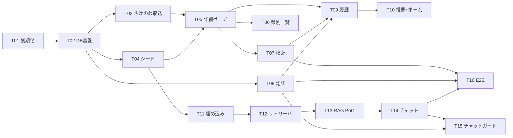

# タスク一覧（TASKS）— Jizake（日本酒レコメンドWebアプリ）

> 作成日: 2026-07-04
> 入力: `docs/DESIGN.md`（7コンポーネント・決定 D1〜D8）／`docs/REQUIREMENTS.md`（FR-01〜FR-08）／
> `docs/DATABASE.md`（10テーブル・インデックス・RLS）／`docs/DIRECTORY_STRUCTURE.md`（配置規則）／
> `docs/GIT_CONVENTIONS.md`（`feature/<ID>-<slug>`）／`docs/FEASIBILITY.md`（R3/R4 PoC 推奨）
> 前提: グリーンフィールド（既存コードなし）。自律実行モードのため、判断が必要な点は設計に沿って決定し、
> 理由を §4（分解上の判断）に記録した。

## 運用ルール

- **1タスク = 1機能 = 1ブランチ = 1PR**。ブランチ名は `feature/<ID>-<slug>`（GIT_CONVENTIONS）。
- 各タスクのマージ時点で `main` は**起動可能・テストグリーン**を保つ（未完成機能への導線は出さない／
  プレースホルダで塞ぐ）。
- 状態は `未着手` → `進行中` → `レビュー中` → `完了` で更新する。

---

## 1. タスク詳細

### T01: プロジェクト初期化（scaffold・CI・共通レイアウト）

| 項目 | 内容 |
|---|---|
| 概要 | Next.js（App Router）プロジェクトの scaffold、テスト・CI 基盤、全ページ共通レイアウトを作り、`main` を「起動可能・テストグリーン」の初期状態にする |
| 主な作業内容 | ① `git init`・`.gitignore`（`.env*` 除外）・`.env.example` ② `create-next-app`（TypeScript・Tailwind v4・`src/` 構成）＋ shadcn/ui 導入（`components.json`・`src/components/ui/`）③ Vitest（`vitest.config.ts`、E2E グロブ除外）・Playwright（`playwright.config.ts`・`e2e/` 空枠）・ESLint/typecheck の npm scripts ④ CI: `.github/workflows/ci.yml`（PR 毎に lint + typecheck + Vitest）⑤ 共通レイアウト: `src/app/layout.tsx`・`src/components/site-header.tsx`・`site-footer.tsx`（**さけのわ帰属表示＋ https://sakenowa.com リンク常設**）・`src/app/error.tsx`・`not-found.tsx`・ホーム `src/app/page.tsx`（プレースホルダ）⑥ ドメイン定数 `src/lib/constants/prefectures.ts`（JIS 47件）・`price-ranges.ts` |
| 受け入れ条件 | —（全 FR の土台。非機能: シークレット非コミット・レスポンシブ・日本語 UI の基盤） |
| 依存タスク | なし |
| ブランチ | `feature/T01-project-setup` |
| 状態 | 完了 |

> 実施メモ（2026-07-04）: ①〜⑥完了（Playwright は設定＋`e2e/` 空枠のみ。CI への E2E 組込は T16）。
> 旧⑦「Vercel プロジェクト接続」は push 運用が始まる T02 の①へ移管した（レビュー指摘 S-2）。

### T02: DB 基盤（Supabase・Drizzle スキーマ 10 テーブル・RLS）

| 項目 | 内容 |
|---|---|
| 概要 | Supabase プロジェクトを作成し、DATABASE.md の物理設計（10テーブル・インデックス・RLS・トリガ）をマイグレーションとして再現可能にする |
| 主な作業内容 | ① Supabase プロジェクト作成・接続情報を `.env.example` へ反映（＋リモート push 運用の開始と Vercel プロジェクト接続: T01 からの持ち越し）② `src/lib/db/schema.ts`（breweries / sakes / tags / sake_tags / profiles / view_histories / search_histories / chat_sessions / chat_messages / sake_embeddings。型の単一情報源）③ `src/lib/db/client.ts` ④ `drizzle.config.ts`・drizzle-kit で `drizzle/` に SQL 生成 ⑤ カスタム SQL マイグレーション: `CREATE EXTENSION vector`・RLS 有効化＋ポリシー（DATABASE §4.2）・`profiles` 自動作成トリガ・HNSW インデックス ⑥ DATABASE §3 のインデックス一式 ⑦ `.github/workflows/ping-supabase.yml`（無料枠 7 日停止対策の定期 ping） |
| 受け入れ条件 | FR-01（DB 格納の受け皿）、非機能「履歴は本人のみ参照可能」（RLS 二段目） |
| 依存タスク | T01 |
| ブランチ | `feature/T02-db-schema` |
| 状態 | 完了 |

> 実施メモ（2026-07-04）: ②〜⑦完了。スキーマ検証は PGlite（インプロセス Postgres＋pgvector 拡張）で実施し、
> マイグレーション一式の適用・制約・トリガ・RLS DDL を `src/lib/db/schema.test.ts` で確認済み
> （auth スキーマ実体と RLS の実効遮断は Supabase 固有のためテスト対象外）。
> **残作業（① の一部。Supabase 実プロジェクト未作成のため持ち越し）**:
> 1. Supabase プロジェクト作成 → `.env.local` に接続情報を設定 → `npm run db:migrate` で適用
>    （詳細手順は `.env.example` のコメント参照）
> 2. GitHub Actions secrets `SUPABASE_URL`・`SUPABASE_ANON_KEY`（＋任意で `DATABASE_URL`）の登録
>    （ping-supabase.yml 用。未登録の間は安全にスキップ）
> 3. Vercel プロジェクト接続（T01 からの持ち越し。ダッシュボード操作が必要）
> 4. ping の実効性確認: 無操作判定は API アクティビティ基準の報告があるため、初回の停止期限（7日）前に
>    Supabase ダッシュボードで一時停止予告が出ていないことを確認する（レビュー指摘 CODE S-3）

### T03: さけのわデータインポート

| 項目 | 内容 |
|---|---|
| 概要 | さけのわ API から蔵元・銘柄・ランキング・フレーバーを取得し、冪等 upsert で DB に投入する（味タグの機械付与を含む） |
| 主な作業内容 | ① `scripts/lib/sakenowa/client.ts`（areas / brands / breweries / rankings / flavor-charts / brand-flavor-tags 取得）② `scripts/lib/sakenowa/schemas.ts`（レスポンスの Zod 検証）③ `scripts/lib/sakenowa/flavor-to-tags.ts`（6軸→味タグ変換の純関数。しきい値は定数）＋ `flavor-to-tags.test.ts`・`fixtures/` ④ `scripts/import-sakenowa.ts`（`sakenowa_brand_id` / `sakenowa_brewery_id` を競合キーに冪等 upsert。`sake_tags` は `source='sakenowa'` のみ入れ替え、`manual` を保全）⑤ `package.json` に `import:sakenowa` script ⑥ 冪等性テスト（2 回実行で同一状態） |
| 受け入れ条件 | FR-01（データ投入が再実行可能）、FR-02（タグ付与） |
| 依存タスク | T02 |
| ブランチ | `feature/T03-import-sakenowa` |
| 状態 | 完了 |

> 実施メモ（2026-07-04）: ①〜⑥完了。テストは PGlite（マイグレーション一式適用）＋実 API から取得した
> 代表サンプルのフィクスチャで実施（冪等性・manual 保全・手作業カラム非上書き・ランキング洗い替えを検証済み）。
> 実測で判明した例外データ（空文字名の蔵元 48 件・同一 (name, areaId) の重複蔵元 43 組）への対応
> （スキップ＋統合）を実装し、`docs/SAKENOWA_API.md` に追記した。
> T02 レビュー Consider の引き継ぎ（drizzle.config の DATABASE_URL 未設定エラー・sql.raw 形式アサーション）も
> 本ブランチで対応済み。
> **残作業**: Supabase 実プロジェクト作成後（T02 残作業）に `npm run import:sakenowa` で実データを投入する。

### T04: 手作業シードデータ投入

| 項目 | 内容 |
|---|---|
| 概要 | 自作説明文・種別タグ・読み仮名・公式 URL・価格帯を `seed-data/` に整備し、冪等 upsert で投入する（RAG・詳細ページの実データ源） |
| 主な作業内容 | ① `seed-data/` に JSON/TS でデータ整備（説明文は必ず自作＝著作権 R2。PoC を見据え**説明文つき銘柄を 50 件以上**用意）② `scripts/seed.ts`（`UNIQUE (brewery_id, name)` / `tags.name` を競合キーに冪等 upsert。種別タグは `source='manual'`）③ `package.json` に `seed` script ④ 冪等性テスト |
| 受け入れ条件 | FR-01（名称・蔵元・都道府県・説明文の充足、再実行可能な投入手順） |
| 依存タスク | T02（T03 と並行可） |
| ブランチ | `feature/T04-seed-data` |
| 状態 | 完了 |

> 実施メモ（2026-07-04）: ①〜④完了。`seed-data/sakes.ts` に主要銘柄 76 件（獺祭・久保田・
> 八海山・十四代・而今・新政・田酒・黒龍・飛露喜・鍋島 等、全 47 都道府県）を自作説明文つきで整備
> （説明文は一般に知られた特徴の範囲で自作＝著作権 R2 回避。捏造した受賞歴は書かない）。
> `scripts/lib/seed/schema.ts`（境界 Zod 検証）を さけのわ schemas.ts と同型で追加し、seed.ts と
> テストの両方で通す。`scripts/seed.ts` は UNIQUE(name, prefecture_code) / UNIQUE(brewery_id, name) /
> tags.name を競合キーに冪等 upsert し、さけのわ由来カラム・source='sakenowa' タグを保全する
> （T03 レビュー引き継ぎ: セカンダリ UNIQUE 衝突・手作業/機械タグ共存に対応）。
> テストは PGlite（マイグレーション一式適用）で冪等性・さけのわ共存・manual 付与を検証し、
> データファイルの妥当性（必須項目・都道府県 01..47・price_range CHECK 値・説明文非空・重複なし）も
> 純粋テストで確認（全 78 テストグリーン）。
> **残作業**: Supabase 実プロジェクト作成後（T02 残作業）に `npm run seed` で実データを投入する。

### T05: 日本酒詳細ページ

| 項目 | 内容 |
|---|---|
| 概要 | `/sake/[id]` で説明・タグ一覧・外部リンク・価格帯を表示する（カタログの最初の縦スライス） |
| 主な作業内容 | ① `src/lib/db/queries/sakes.ts`（詳細取得・`SakeSummary` 型。横断クエリ）② `src/app/sake/[id]/page.tsx`（RSC 直接クエリ、`revalidate = 3600`）③ `src/app/sake/[id]/_components/`（タグ一覧・外部リンク: `target="_blank" rel="noopener"`、`official_url`/`amazon_url` 欠損時は Amazon 検索 URL 生成 or 非表示、価格帯表示）④ `src/components/sake-card.tsx`（銘柄カード。以降の一覧・推薦・チャットで共用）⑤ 存在しない ID は `not-found` |
| 受け入れ条件 | FR-01（詳細が取得・表示できる）、FR-02（詳細でタグ一覧表示）、FR-03（全条件） |
| 依存タスク | T03, T04（表示する実データ） |
| ブランチ | `feature/T05-sake-detail` |
| 状態 | 完了 |

> 実施メモ（2026-07-04）: ①〜⑤完了。① `src/lib/db/queries/sakes.ts` に
> `getSakeDetail`（公開）/`selectSakeDetail`（db 注入・テスト用）を追加し、
> `SakeSummary`/`SakeDetail`/`FlavorChart`/`SakeTagSummary` 型を定義（銘柄＋蔵元 INNER JOIN、
> タグは category→name 順）。id は UUID 書式検証で不正値を DB 問い合わせ前に弾き 404 化。
> ② `src/app/sake/[id]/page.tsx` は RSC 直接クエリ・`revalidate=3600`・`generateMetadata` で
> 銘柄名タイトル。③ `_components/`（タグ一覧・説明〔whitespace-pre-line で改行保持のテキスト描画〕・
> フレーバー6軸バー・外部リンク）＋ `_lib/external-links.ts`（純関数。official/rakuten は欠損非表示、
> amazon は欠損時に銘柄名から検索 URL 生成、https 限定の防御的多重化）。外部リンクは
> `target="_blank" rel="noopener noreferrer"`。④ `src/components/sake-card.tsx`（共有カード。詳細へ Link）。
> ⑤ 存在しない/不正 id は `notFound()`。REVIEW T03/T04 引き継ぎ（外部入力の生 HTML 描画禁止・
> https 外部リンク）をコンポーネントとテストで担保。
> テストは PGlite（クエリ結合・NULL 可カラム・存在しない id）＋ RTL 相当の SSR 出力検証
> （カード・外部リンクの target/rel・ページの notFound 分岐・メタデータ）で実施（全 105 テストグリーン）。
> トップ/ヘッダーからの到達導線は未実装機能を出さない運用ルールに従い未追加（T06/T07/T10 で接続）。

### T06: 都道府県別地酒一覧

| 項目 | 内容 |
|---|---|
| 概要 | 都道府県の選択 UI から `/prefectures/[code]` の地酒一覧に到達し、カードから詳細へ遷移できる |
| 主な作業内容 | ① `src/lib/db/queries/sakes.ts` に県別一覧クエリ追加（蔵元 JOIN、ページネーション 24 件/頁）② `src/app/prefectures/[code]/page.tsx`（`revalidate = 3600`）③ 都道府県選択 UI（リスト形式。`src/lib/constants/prefectures.ts` 参照）をホームまたは同セグメント `_components/` に配置 ④ 不正コードは `not-found` |
| 受け入れ条件 | FR-07（選択 UI から一覧に到達） |
| 依存タスク | T05（sake-card・クエリ基盤）。T07 と並行可 |
| ブランチ | `feature/T06-prefecture-list` |
| 状態 | 完了 |

> 実施メモ（2026-07-04）: ①〜⑤完了。① `src/lib/db/queries/sakes.ts` に
> `selectSakesByPrefecture`（db 注入・テスト用）/`getSakesByPrefecture`（React.cache 公開）を追加し、
> 銘柄×蔵元 INNER JOIN を `breweries.prefecture_code` で絞って `SakeSummary[]` を名前→id の安定順で返す。
> 一覧カード用タグは `selectTagsBySakeIds` で銘柄 ID 配列から 1 クエリ一括取得してメモリで束ね、
> 銘柄数によらず計 2 クエリに抑える（N+1 回避）。② `src/app/prefectures/[code]/page.tsx` は
> RSC 直接クエリ・`revalidate=3600`・`generateMetadata` で「〇〇県の地酒」。JIS コード（01..47）以外は
> `findPrefectureByCode` の undefined 判定で `notFound()` に落とし DB へ問い合わせない。0 件は空状態メッセージ。
> ③ `src/app/prefectures/page.tsx` は `prefectures.ts` を単一情報源に `_lib/regions.ts`（地方 8 区分の純関数）で
> グルーピングした 47 都道府県リンク一覧（DB 非依存・静的配信）。④ 一覧は共有 `SakeCard` の初の実利用
> （非破壊で再利用。県名はカード内に出るが実害なく prop 追加はしない）。⑤ ヘッダーナビ「地酒を探す」＋
> ホームの導線ボタンを追加。テストは PGlite（県別絞り込み・タグ一括束ね・空状態・安定順）＋ SSR 出力検証
> （ページの notFound 分岐・空状態・メタデータ・選択 UI の全 47 リンク・地方グルーピング）で実施
> （全 122 テストグリーン。lint / typecheck / format:check / build 済み）。
> ブランチ名は指示に従い `feature/T06-prefecture-list`（TASKS 当初案 `feature/T06-prefectures` から変更）。
>
> レビュー対応（2026-07-04・4 ペルソナ Should 反映）: ①**ページネーション（24 件/頁）を実装**。
> `PAGE_SIZE=24` 定数（DESIGN §6.1）を定義し、`selectSakesByPrefecture(db, code, page)` に
> `limit/offset` と総件数 count クエリを追加、返り値を `{ sakes, total, page, pageSize }` に変更
> （`getSakesByPrefecture` の React.cache も page をキーに含める）。タグ一括取得はそのページ分の
> 銘柄 ID のみに渡すため計 3 クエリ（count + 一覧 + タグ）。ページは `_lib/pagination.ts` の純関数
> `parsePageParam`（0・負・非数・小数は 1 に丸め）/`totalPageCount`（切り上げ・0 件でも 1）で処理し、
> 総ページ数超過は最終ページへ `redirect`。UI に前へ/次へ・現在/総ページのページャ（1 頁に収まる県は非表示）、
> 「N 件」は総件数を表示。②**`generateStaticParams` を追加**して 47 コードをビルド時プリレンダ対象化
> （build で 5→52 静的生成。?page= の searchParams のため Route 判定上は ƒ だが 47 パスは事前生成＋ISR 併用。
> 完全静的化はパスセグメント化する将来の最適化余地としてコメント記載）。追加テスト: PGlite で 30 件投入の
> 2 頁分割・page=2 内容・範囲外・総件数、純関数のページ丸め、SSR でページャ表示/非表示・redirect・
> 静的パラメータ（全 136 テストグリーン）。

### T07: 検索機能

| 項目 | 内容 |
|---|---|
| 概要 | 名前（部分一致）× 都道府県 × 味タグの複合検索。URL クエリパラメータ駆動（決定 D7）で結果一覧→詳細へ遷移できる |
| 主な作業内容 | ① `src/app/search/_lib/build-search-query.ts`（URL パラメータ→検索条件の純関数、Zod で `SearchParams` に正規化）＋ `build-search-query.test.ts` ② `src/app/search/_lib/search-sakes.ts`（`name ILIKE` + `reading ILIKE`・蔵元 JOIN・タグ EXISTS の AND 結合、ページネーション）③ `src/app/search/page.tsx`（SSR）④ `src/app/search/_components/`（検索フォーム・結果一覧・**0件時の空状態＋条件緩和導線**）⑤ タグ一覧クエリ `src/lib/db/queries/tags.ts` |
| 受け入れ条件 | FR-06（全条件）、FR-02（タグをキーに絞り込める） |
| 依存タスク | T05。T06 と並行可 |
| ブランチ | `feature/T07-search` |
| 状態 | 完了 |

> 実施メモ（2026-07-04）: ①〜⑤完了。設計判断:
> - **味タグは AND 絞り込み**（「辛口かつ淡麗」で絞る）。タグごとに sake_tags×tags の EXISTS を
>   相関サブクエリで作り AND 連結（DESIGN §2.2 の複合絞り込み意図に沿う。OR より意図が明確）。
> - **都道府県は単一**（`prefectureCode?: string`）。複数県の要求がないため YAGNI。
> - **空条件時は全件を名前順で表示**（DESIGN §2.2 に既定なし。空状態で入力を促さず全件＋ページャに倒す）。
>   検索フォームは常に表示。`isEmptyCriteria` は履歴記録（T09）の「空検索は記録しない」判定にも再利用可。
> - **ページネーションは T06 の基盤を共有**。`_lib/pagination.ts` を `src/lib/pagination/pagination.ts`
>   へ責務名昇格し、県別一覧（T06）と検索（T07）の 2 機能で共有（機能固有 `_lib` 同士のパス依存を避ける。
>   DIRECTORY_STRUCTURE §5.3）。T06 側の import も更新済み。page 番号の正規化・上限（DoS 対策）も
>   `parsePageParam` に一本化。
> - **検索クエリ `searchSakes` は当初計画の `_lib/search-sakes.ts` を作らず `src/lib/db/queries/sakes.ts`
>   に集約**（`SakeSummary`・タグ一括取得を県別一覧と共有＝DIR-6 の横断クエリ判定。DESIGN §5.3・
>   DIRECTORY_STRUCTURE §2 ツリーも実配置に更新。CODE/PHIL レビュー指摘）。タグは `tagIds` でなく
>   `tagNames`（URL `?tags=` と DATABASE §2.7 filters に統一）、味タグは集合としてソート正規化（決定性）。
> - 実データ投入は Supabase 実プロジェクト作成後（T02 残作業）。ロジックは PGlite で検証済み。

### T08: 認証（サインアップ・ログイン・ログアウト）

| 項目 | 内容 |
|---|---|
| 概要 | Supabase Auth（メール＋パスワード）でサインアップ／ログイン／ログアウトでき、セッションが維持される |
| 主な作業内容 | ① `src/lib/auth/server.ts`・`client.ts`・`session.ts`（`@supabase/ssr` 標準パターン。supabase-js の型をここで閉じる）② `src/lib/auth/actions.ts`（signUp / signIn / signOut、Zod 入力検証）③ `src/app/login/page.tsx`・`src/app/signup/page.tsx`（`?next=` リダイレクト対応）④ `src/middleware.ts`（`updateSession`。`/history` ガードは T09 で有効化）⑤ `src/components/site-header.tsx` にログイン状態表示・ログアウト導線 |
| 受け入れ条件 | FR-04（サインアップ／ログイン／ログアウト） |
| 依存タスク | T02（profiles トリガ）、T01。T05〜T07 と並行可 |
| ブランチ | `feature/T08-auth` |
| 状態 | 完了 |

> 実施メモ（2026-07-04）: ①〜⑤完了。設計判断と実装内容:
> - **@supabase/ssr 標準パターン**: `src/lib/auth/` に境界を閉じ、`@supabase/*` import はここのみに限定
>   （DIRECTORY_STRUCTURE §5.2）。`server.ts`（RSC/Action 用 `createServerClient`＋`getCurrentUser`。
>   supabase-js の User 型を `AuthUser`= `{id, email}` に変換して外へ漏らさない）／`client.ts`
>   （`createBrowserClient`。今回は未使用だが標準パターンとして用意）／`session.ts`（middleware 用
>   `updateSession`）を分離。`env.ts` で公開接続情報を**遅延取得**し、環境変数未設定でも import・ビルドが
>   壊れないようにした（ランタイムで認証を使うと明確なエラー。閲覧・検索など匿名機能は動く）。
> - **middleware → proxy へ改名**: Next.js 16.2 が `middleware` を deprecated と警告するため、
>   `src/proxy.ts`（export `proxy`）に改名（DIRECTORY_STRUCTURE §2 注記の許容範囲）。matcher は
>   @supabase/ssr 公式推奨。`getUser()` で実トークン検証し、`getSession()`（Cookie 無検証）は使わない。
> - **ルート保護は /history のみ**（DESIGN §2.3）。指示スコープに従い**本タスクで有効化**（未ログインで
>   `/history` → `/login?next=/history`）。判定は純関数 `redirect.ts`（`isProtectedPath`・
>   `sanitizeRedirectPath`・`resolveAfterLogin`・`buildLoginRedirect`）に切り出し、境界一致で `/historyx`
>   を誤保護しないことも検証。他ページは未ログインでも閲覧可（Progressive Personalization）。
> - **オープンリダイレクト防止**（REVIEW T05 引き継ぎ・DESIGN §6.2）: `?next=` は自サイト内パスのみ許可
>   （先頭 `/`・`//` とプロトコル相対・バックスラッシュ・制御文字を弾く純関数）。Server Action の成功遷移・
>   ページの既ログイン遷移・フォームの hidden の 3 箇所すべてで検証（多層防御）。
> - **入力バリデーション**（`validation.ts`）: メール形式＋パスワード長（6..72）を Zod 純関数で検証。
>   エラー文言（`messages.ts`）はアカウント存在の推測を防ぐ汎用化（ログイン失敗はメール不存在と
>   パスワード誤りを区別しない）。ともにユニットテスト。
> - **ページ/ヘッダー**: `login`/`signup` は RSC で既ログインなら遷移、`AuthForm`（Client・useActionState）で
>   エラー表示。ヘッダーは async RSC 化し、ログイン状態で導線を出し分け（未: ログイン/新規登録、
>   済: 履歴＋ログアウト〔Server Action フォーム〕）。`/history` は保護枠のみ（中身は T09）。
> - パスワードのハッシュ化・セッション管理・CSRF は Supabase Auth／@supabase/ssr に委任（自前実装なし）。
>   認証 Cookie は @supabase/ssr が httpOnly で扱う。
> - テストは純関数（redirect 15・validation 7・messages 3）＋ SSR 出力/RTL（ヘッダー状態別・login/history の
>   リダイレクト分岐・AuthForm）で実施（全 215 テスト。lint/typecheck/format:check/build グリーン）。
> - T09 との整合: TASKS T09 ④「/history ガードを middleware で有効化」は本タスクで先行実装済み。
>   T09 では履歴記録 Server Action・`/history` の一覧クエリ（user_id はセッション強制）を実装する。
>
> **残作業（Supabase 実プロジェクト未作成のため持ち越し。実キーがないと疎通不可）**:
> 1. Supabase プロジェクト作成後、`.env.local` に `NEXT_PUBLIC_SUPABASE_URL`・`NEXT_PUBLIC_SUPABASE_ANON_KEY`
>    を設定（T02 残作業と同時）→ 実際のサインアップ／ログイン／ログアウト／セッション維持の疎通確認。
> 2. サインアップ時の `profiles` 自動作成トリガ（DATABASE §2.5）が効くことの実環境確認。
> 3. Supabase ダッシュボードでメール確認（Confirm email）設定の確認: 既定 ON だと signUp 直後は
>    未確認セッションになる可能性がある。PoC 段階では Confirm email を OFF にするか、確認メール導線を
>    追加するか運用判断が必要（本実装は signUp 成功で next へ遷移する前提。実環境で挙動確認）。
> 4. Supabase クライアントを直接叩く統合テスト（実キー前提）と E2E（サインアップ・ログイン）は T16 で実施。

### T09: 履歴記録と履歴画面

| 項目 | 内容 |
|---|---|
| 概要 | 詳細閲覧・検索実行を Server Action で記録し、本人だけが `/history` で参照できる |
| 主な作業内容 | ① `src/app/sake/[id]/_actions/record-view.ts`・`src/app/sake/[id]/_components/` に記録トリガ Client Component（マウント時 fire-and-forget、未ログインは no-op、失敗は表示に影響させない）② `src/app/search/_actions/record-search.ts`（`filters` jsonb に条件スナップショット。0 件検索も記録）③ `src/app/history/page.tsx`・`_lib/queries.ts`（**user_id を引数で受けず認証セッションから強制**＝主防御）④ `src/middleware.ts` の `/history` ガード（未ログイン→`/login?next=/history`） |
| 受け入れ条件 | FR-05（閲覧・検索が履歴として記録される）、FR-04（未ログインで履歴アクセス時に誘導） |
| 依存タスク | T05, T07, T08 |
| ブランチ | `feature/T09-history` |
| 状態 | 完了 |

> 実施メモ（2026-07-04）: ①〜⑤完了。設計判断と実装内容:
> - **fire-and-forget の記録**（DESIGN §2.4 / 決定 D3）: 詳細ページ・検索結果ページに小さな Client
>   Component（`_components/record-view-trigger.tsx`・`record-search-trigger.tsx`）を置き、実ブラウザの
>   マウント時に `useEffect` から Server Action（`record-view.ts`・`record-search.ts`）を `void`（await せず）
>   で呼ぶ。RSC レンダリング中に INSERT しないことでプリフェッチ・キャッシュ・ボットの多重記録を避け、実閲覧・
>   実検索のみを記録する。記録の失敗は表示に影響させない（Server Action 内で握るがログは必ず出す＝握りつぶし禁止
>   規約に反さない吸収）。
> - **多重記録の抑制**: DESIGN §2.4 は「追記専用で毎回記録してよい・避けるのはプリフェッチ多重のみ」。同一マウント内
>   の重複発火（React 18 StrictMode の二重マウント・同一値での再レンダリング）だけを `useRef` ガードで 1 回に抑える。
>   閲覧は `sakeId`、検索は「page を除いた条件のシリアライズ」をキーにし、条件が変われば再記録・ページ送りでは
>   再記録しない（ページ送りは同一検索の続き）。
> - **user_id 二段防御**（DESIGN §6.2 / DATABASE §4.1）: 主防御=公開関数（`getViewHistoryPage`・
>   `getSearchHistoryPage`・`recordView`・`recordSearch`）は **user_id を引数で受けず**必ず `getCurrentUser` で
>   セッションから取得。クライアントが渡せるのは sakeId / criteria のみで、他人の user_id で読み書きする経路が
>   UI に露出しない。下位の `selectViewHistory`/`selectSearchHistory` は db・userId を引数で受けてテスト可能に
>   するが、これらへ userId を渡すのは公開関数だけ。二段目=RLS（本人 SELECT・書き込みポリシーなしで anon 全拒否）。
> - **filters スナップショット**（DATABASE §2.7 / 決定 DB-5・DB-9 の CHECK と対応）: `q` は `query` カラム、
>   都道府県・タグは `filters`(jsonb) に `SearchCriteria` と同形で保存（`{"prefectureCode":"35","tagNames":["辛口"]}`）。
>   `page` は含めない（再検索は 1 ページ目から）。空条件（`isEmptyCriteria`）は記録しない（空検索=全件表示のため）。
>   0 件ヒットでも条件があれば記録する（「探したが無かった」も嗜好情報）。
> - **履歴クエリの配置**（DIR-3）: `/history` からしか使わない機能固有クエリのため `history/_lib/queries.ts` に置き、
>   横断カタログクエリ（`src/lib/db/queries`）へは昇格しない。銘柄要約は `SakeSummary`・`selectTagsBySakeIds`
>   （export 化）・`PAGE_SIZE` を再利用し、閲覧履歴は view_histories×sakes×breweries を JOIN・viewed_at DESC・
>   ページ分のタグを 1 クエリ一括取得（N+1 回避）。
> - **/history ページ**: T08 のプレースホルダを置換。閲覧履歴は `SakeCard`（詳細リンク）＋ JST 閲覧日時、検索履歴は
>   条件バッジ＋ `/search?...` 再検索リンク（`_lib/format.ts` の純関数 `searchHistoryToHref`/`Labels`/`formatViewedAt`）。
>   0 件は空状態＋検索導線。未ログインは middleware＋ページ側 `getCurrentUser` の多層防御で `/login?next=/history`。
> - **逸脱記録**（DIR-11・§5.2 例外）: 履歴 `_lib` から検索 `_lib`（`SearchCriteria`・`toSearchQueryString`・
>   `isEmptyCriteria`）を一方向参照。検索が URL⇔条件の唯一の情報源で再実装は二重定義になるため。循環なし。
>   3 機能目が現れたら責務名ディレクトリへ昇格する。DESIGN §5.3 の recordSearch シグネチャも実装（SearchCriteria）に更新。
> - テストは PGlite（履歴クエリ: 本人分のみ・他人の履歴が漏れない・時系列降順・JOIN／Server Action: 未ログイン no-op・
>   不正 id no-op・空条件スキップ・正常記録・user_id 強制・追記・失敗時ログのみ）＋純関数（format）＋ Client Component
>   （トリガの発火・多重抑制・fire-and-forget）＋ SSR 出力（/history の空状態・閲覧/検索履歴表示・未ログイン redirect）で
>   実施（全 251 テスト。lint / typecheck / format:check / build グリーン）。
> - **残作業**: 実際の認証済みユーザーでの記録・RLS 実効遮断は Supabase 実プロジェクトが要る（T02 残作業）。E2E は T16。

### T10: 履歴ベース推薦エンジン＋ホーム画面表示

| 項目 | 内容 |
|---|---|
| 概要 | ルールベース推薦エンジン（固定 IF・差し替え可能）を実装し、ホームに推薦カード列を表示する縦スライス |
| 主な作業内容 | ① `src/lib/recommend/types.ts`（`recommend(input)` の固定 IF・`RecommendedSake`/`RecommendReason`）② `src/lib/recommend/rule-based.ts`（直近履歴のタグ＋都道府県〔擬似タグ〕頻度を時間減衰つきで集計する単一 SQL → 未閲覧銘柄をタグ一致度でスコアリング）③ `src/lib/recommend/scoring.ts`（スコア計算の純関数、重み定数を注入可能に）＋ `scoring.test.ts` ④ コールドスタート: 履歴 3 件未満・未ログインは `popularity_rank` 上位＋ランダム性のフォールバック（reason: "人気の銘柄"）⑤ `src/lib/recommend/index.ts`（実装の選択）⑥ `src/app/page.tsx`・`_components/` で推薦カード列＋ reason 表示。未ログイン時はログイン誘導を併記 |
| 受け入れ条件 | FR-05（ホームに履歴ベースのおすすめ表示＋フォールバック） |
| 依存タスク | T09（履歴データ）、T05（sake-card） |
| ブランチ | `feature/T10-recommend`（指示に従い当初案 `feature/T10-recommend-home` から変更） |
| 状態 | 完了 |

> 実施メモ（2026-07-04）: ①〜⑥完了。設計判断と実装内容:
> - **固定インターフェース（差し替え可能な知能。PLAN_PHILOSOPHY 原則3 / DESIGN §2.5）**:
>   `src/lib/recommend/types.ts` に `recommend({ userId, limit }): Promise<RecommendedSake[]>` の契約
>   （`RecommendedSake = { sake: SakeSummary; reason: RecommendReason }`）を定義。実装の選択は
>   `index.ts` の 1 箇所だけが行い、現在は `rule-based.ts`（タグ頻度＋時間減衰）へ委譲する。将来
>   協調フィルタリング等へ差し替える際は同ディレクトリに別ファイルを足し index.ts の委譲先を変える
>   だけで、呼び出し側（`src/app/page.tsx`）は無変更（DIRECTORY_STRUCTURE 例2 が実際に成立）。
> - **スコアリングの純関数分離（TEST_PHILOSOPHY）**: `scoring.ts` に (a) 履歴イベント→嗜好プロファイル
>   （時間減衰つき頻度集計 `buildPreferenceProfile`）(b) プロファイル＋候補→スコア（`scoreCandidates`）を
>   DB 非依存の純関数として切り出し、`rule-based.ts`（DB アクセス）と分離。重み・減衰は `ScoringWeights`
>   定数（`DEFAULT_WEIGHTS`）に集約し関数引数で注入可能（マジックナンバー禁止。CODING_PHILOSOPHY）。
> - **時間減衰は指数（半減期方式）**: `timeDecay = 0.5^(ageDays/halfLifeDays)`（既定 halfLifeDays=14）。
>   線形（打ち切り式）は打ち切り日以前が一律 0 になり嗜好が階段状に飛ぶため、直近を強く反映しつつ古い
>   履歴も緩やかに残す指数を採用。閲覧 1.0 / 検索 0.7（検索は AND 複数タグで過大評価しやすいためやや軽く）、
>   都道府県は擬似タグ倍率 0.6（産地だけで埋まらないよう味タグより弱める。DESIGN §3・D2 の擬似タグ扱いを
>   ロジック側に閉じる）。初期値は DESIGN §9 の「実装時に定数化し調整」に沿う暫定値。
> - **閲覧済み銘柄は「除外」（減点でなく）**: ホームは新規発見の面であり既視銘柄の再提示は価値が薄い。
>   閲覧履歴自体は /history で参照できる。`scoreCandidates` が viewedSakeIds を除外し、候補取得 SQL でも
>   `not in` で先に外す（メモリに載せる候補集合を小さく保つ）。スコア 0（一致なし）も落とす。
> - **コールドスタート条件＝「未ログイン or 履歴イベント総数 < しきい値(3)」**: 未ログイン（userId=null）と
>   履歴 3 件未満を同じフォールバック（`popularity_rank` 上位を Fisher-Yates でシャッフルし limit 件）に
>   落とす（reason: popular=「人気の銘柄」。DESIGN §2.5・§4.2）。popularity_rank が NULL の銘柄は母集団に
>   入れない（index 3 の部分インデックス対象）。履歴ベースでスコア上位が limit に満たない場合も人気銘柄で
>   補完し、ホームを常に埋める。
> - **嗜好プロファイルの表現**: `{ tags: Map<name, weight>; prefectures: Map<code, weight> }`。都道府県は
>   正規化を保ったまま（テーブル化しない D2）ロジック側で擬似タグとしてタグ空間に混ぜる。検索履歴の
>   filters(jsonb) は DB を信頼せず `readFilterSignals` で防御的に読む（unknown ガード。REVIEW T09 の姿勢を踏襲）。
> - **横断配置（DIRECTORY_STRUCTURE DIR-6・§5.1）**: 推薦は複数画面・将来のチャット（T14）からも使う横断
>   ロジックのため `src/lib/recommend/` に置く。既存資産を再利用（重複実装なし）: `SakeSummary`・
>   `selectTagsBySakeIds`（タグ N+1 回避の一括取得）・`CatalogDb`（PGlite 差し込み型）・`SakeCard`・
>   `getCurrentUser`（React.cache 済み）・`findPrefectureByCode`。推薦理由の文言化は `app/_lib/
>   recommend-reason-label.ts`（ホーム専用の純関数）に分離し、RecommendReason の構造だけを UI が知る。
> - **ホーム画面（`src/app/page.tsx` のプレースホルダを置換）**: `getCurrentUser` の有無で `recommend` に
>   userId を渡し分け、見出しを「あなたへのおすすめ」/「人気の日本酒」で出し分け。未ログインには
>   ログイン/新規登録の誘導を併記（思想: 認証を機能のゲートにしない。DESIGN §2.3・PLAN_PHILOSOPHY 原則5）。
>   各カードに reason を軽く添える（推薦の透明性。DESIGN §4.2）。ユーザー依存のため `dynamic=force-dynamic`。
> - テストは純関数（scoring: 時間減衰・嗜好集計・スコアリング・閲覧済み除外・重み注入／reason-label 文言）＋
>   統合（PGlite: 履歴ありユーザーは嗜好一致銘柄が上位・閲覧済み除外・人気補完・limit 遵守／コールドスタートは
>   人気順・未ログイン・履歴しきい値未満・limit 0）＋ SSR 出力（ログイン/未ログインで見出し・内容・ログイン誘導が
>   変わる。getCurrentUser・recommend をモック）で実施（全 282 テスト。lint / typecheck / format:check / build
>   グリーン。T09 の 254 から +28）。
> - **残作業**: 実際の認証済みユーザーでの推薦（実履歴データ）は Supabase 実プロジェクトが要る（T02 残作業）。
>   ロジックは PGlite＋モックで検証済み。E2E は T16。重み・減衰の実データでのチューニングは稼働後（DESIGN §9）。
>
> レビュー対応（2026-07-04・4 ペルソナ Should/Consider 反映）:
> - **候補母集団の上限（PERF/SEC S-1）**: `RuleBasedConfig` に `candidatePoolSize`(200)・`maxProfileTags`(30) を
>   追加。候補取得 SQL を人気順（`popularity_rank asc nulls last` → id）で上位 candidatePoolSize 件に切ってから
>   メモリでスコアリングし、汎用タグ持ちヘビーユーザーでの自己 DoS を防ぐ。プロファイルは
>   `truncateProfileTags`（scoring.ts の純関数）で重み上位 K 件に絞ってから IN に渡す。
> - **全期間の既視除外（CODE S-1）**: 嗜好集計用の履歴取得（`collectHistory`・直近 recentHistoryLimit 件）と、
>   除外用の閲覧済み ID 集合（`selectViewedSakeIds`・全期間 distinct・`excludeIdCap`(5000) 上限）を分離。100 件超の
>   ユーザーでも既視銘柄が推薦に混入しない（「ホームは新規発見」の不変条件を全期間で担保）。
> - **フォールバックの件数充足（CODE S-2）**: `selectPopular` の母集団取得を `limit(max(poolSize, limit))` にし、
>   limit > poolSize でも件数不足にならない不変条件を保証。
> - **単一 SQL 記述の乖離解消（PHIL S-1）**: DESIGN §2.5/§4.2 を「複数クエリ（履歴集計・候補絞り込み・タグ一括・
>   人気補完）＋スコア計算の純関数」に更新（selectTagsBySakeIds 再利用・候補 SQL 事前絞りのため分割）。
> - **ホーム見出しの実態整合（PHIL S-2）**: ログイン済みでも中身が全て popular（履歴しきい値未満）なら見出しを
>   「人気の日本酒」に倒す（`recommendations.some(reason.kind==="history")` で判定）。
> - **Consider**: 公開 IF `recommend()` で limit を `min(max(0,limit), 50)` にクランプ（SEC C-1）。コールドスタート
>   （`fallbackOnly`）にも閲覧済み ID を渡して既視除外（CODE C-1）。
> - 追加テスト: `truncateProfileTags` 純関数、候補上限で母集団が切られる・全期間の既視除外（直近取得上限超）・
>   limit>poolSize の件数充足の PGlite 回帰（全 290 テスト。lint / typecheck / format:check / build グリーン）。

### T11: 埋め込みパイプライン

| 項目 | 内容 |
|---|---|
| 概要 | 説明文の埋め込みを差分生成して `sake_embeddings` に upsert する（RAG の知識源整備） |
| 主な作業内容 | ① `src/lib/ai/models.ts`（AI Gateway 経由のモデル ID 定数）・`src/lib/ai/embedding.ts`（`embedText(text)`。Web とバッチで共用、AI SDK の import はここに集約）② `scripts/embed.ts`（description の SHA-256 を `source_hash` と比較し**変更行のみ再埋め込み**、`model` 列で差し替え時の再生成判定）③ `package.json` に `embed` script ④ 差分判定ロジックのユニットテスト |
| 受け入れ条件 | FR-08 の基盤（知識源の埋め込み） |
| 依存タスク | T04（説明文）。T05〜T10 と並行可 |
| ブランチ | `feature/T11-embedding-pipeline` |
| 状態 | 完了 |

> 実施メモ（2026-07-04）: ①〜⑤完了。設計判断と実装内容:
> - **AI SDK v6（Gateway 経由）**: `ai@^6.0.219`（TECH_STACK §5 の 6 系採用・v7 見送りに準拠）を
>   依存に追加。`src/lib/ai/embedding.ts` に AI SDK の import を閉じ込め（DIRECTORY_STRUCTURE §5.2:
>   AI SDK の import は lib/ai と api/chat のみ許可）、`embed`/`embedMany` を `gateway.textEmbeddingModel`
>   に渡して呼ぶ。モデル ID は `src/lib/ai/models.ts` の定数 `EMBEDDING_MODEL_ID="openai/text-embedding-3-small"`・
>   `EMBEDDING_DIMENSIONS=1536`（差し替えはこの 1 箇所。DIRECTORY_STRUCTURE §5.1）。
> - **埋め込み対象テキストの構成**（`buildEmbeddingText` 純関数）: 「銘柄名＋蔵元＋都道府県名＋説明文＋タグ」を
>   ラベル付き（`銘柄: / 蔵元: / 都道府県: / 説明: / タグ:`）の日本語 1 テキストに組み立てる。都道府県は
>   `findPrefectureByCode`（既存定数を再利用）でコード→県名に解決し、未解決・タグなしは行ごと省く。タグは
>   決定性のため名前順ソート（並び替えでハッシュがブレない）。DB スキーマ非依存の入力型 `EmbeddingSource` にし、
>   `scripts/embed.ts` が銘柄行から詰める。
> - **sourceHash アルゴリズム＝SHA-256(hex)**（`computeSourceHash` 純関数。DATABASE.md §2.10 が SHA-256 hex と規定）:
>   埋め込みテキスト全体をハッシュ。説明文だけでなくタグ・蔵元・都道府県の変化も検知する（テキストが変われば
>   再埋め込みされる）。DESIGN §2.7「説明文のハッシュ」を、埋め込み対象テキスト＝差分基準に統一した。
> - **差分埋め込み**（`selectWorkItems` 純関数＋`embedSakes`）: description 非空の銘柄を候補にし、既存
>   `sake_embeddings`（sakeId→{sourceHash, model}）と突き合わせ、**未登録・source_hash 変化・model 変化**の
>   いずれかに該当する銘柄だけ埋め込み生成→`sake_id` 競合キーで冪等 upsert（`model` 列に使用モデルを記録）。
>   差分なしは API を一切叩かない（DESIGN §6.3 のコスト最小化）。既存 `seed.ts`/`import-sakenowa.ts` の
>   chunk・isDirectRun・closeDb（try/finally）パターンと `selectTagsBySakeIds`（タグ一括取得・N+1 回避）を再利用。
> - **キー未設定時の挙動**: `AI_GATEWAY_API_KEY` は gateway プロバイダが実行時に参照するため import・build 時は
>   不要（未設定でもモジュール読込・ビルドは壊れない＝閲覧/検索など匿名機能に影響しない）。`npm run embed` の
>   main は埋め込み生成前にキーの有無を明示チェックし、未設定なら DB を叩く前に明確なエラーで停止する
>   （握りつぶさない）。`.env.example` に用途・取得手順を追記。
> - **注入可能性（TEST_PHILOSOPHY: 実 API を叩かない）**: `embedSakes(db, embed, model)` は埋め込み関数
>   （`EmbedTextsFn`）を注入口にし、本番は `embedTexts`（実 API）、テストは決定的なフェイクベクトル（1536次元）を
>   渡す。実 API 呼び出し部分はテストで一切実行しない。
> - テストは純関数（テキスト組み立て: 5 要素の包含・決定性・タグ順不同同一・タグ/都道府県省略／sourceHash:
>   hex 形式・同一入力同一・説明文/タグ変化検知）＋差分判定（未登録・差分なし・hash 変化・model 変化）＋
>   PGlite 統合（初回全件・説明文なし除外・2 回目差分ゼロ・変更行のみ再埋め込みと hash 更新・model 差替で全件・
>   タグ変化・1536次元格納。フェイク埋め込み注入）で実施（全 309 テスト。lint/typecheck/format:check/build グリーン。
>   T10 の 290 から +19）。
> - **残作業**: 実 API 疎通（AI Gateway で text-embedding-3-small を実際に叩く）は `AI_GATEWAY_API_KEY` 実キーと
>   Supabase 実 DB（T02 残作業の投入済みデータ）が要る。手順: `.env.local` に `AI_GATEWAY_API_KEY` を設定 →
>   `npm run seed` で説明文投入 → `npm run embed` で埋め込み生成。日本語埋め込み精度の検証（FEASIBILITY R3/R4）と
>   retriever 重みの確定は **T13 の PoC** で実施する（本タスクはパイプラインの整備まで）。

### T12: RAG リトリーバ＋捏造防止検証

| 項目 | 内容 |
|---|---|
| 概要 | LLM 非依存のハイブリッド検索（SQL 絞り込み＋ pgvector 類似度）と、提案 ID の DB 存在検証を実装する |
| 主な作業内容 | ① `src/lib/rag/retriever.ts`（`retrieveSakeCandidates()`: タグ・都道府県・価格帯の SQL 絞り込み＋ `<=>` コサイン類似度。必ず実在 sakeId を含む候補を返す、候補上限は定数〔初期 8 件〕）② `retriever.test.ts`（テスト DB での統合テスト）③ `src/lib/rag/validate-proposed.ts`（`validateProposedSakeIds()`: 実在 ID のみ返す）＋ `validate-proposed.test.ts` |
| 受け入れ条件 | FR-08（提案は DB 実在の銘柄のみ＝捏造防止の一段目・二段目の部品） |
| 依存タスク | T11 |
| ブランチ | `feature/T12-rag-retriever` |
| 状態 | 完了 |

> 実施メモ（2026-07-04）: 作成 `src/lib/rag/retriever.ts`・`validate-proposed.ts` ＋各テスト。
> ③味タグ・都道府県の抽出は retriever が「渡された条件＋freeText」で動くため専用ファイルを持たない
> （レビュー PHIL S-1 で当初の `extract-conditions.ts` を削除。下記参照）。設計判断と実装内容:
> - **retriever は LLM 非依存を厳守（DESIGN §2.6 の retriever/generator 分離）**: `src/lib/rag` から
>   AI SDK・streamText は一切 import しない。依存は共通カタログ（`SakeSummary`・`selectTagsBySakeIds`・
>   `buildTagAndFilters`）と埋め込みアダプタ（`embedText`）のみ。埋め込み関数は `EmbedQueryFn` で注入し、
>   テストはダミーのクエリベクトルを差し込む（実 API を叩かない。TEST_PHILOSOPHY）。generator（streamText）は
>   T14 の `/api/chat` の責務。
> - **ハイブリッド統合＝タグはハード SQL 絞り込み・ベクタはソフトなランキング**（DESIGN §2.6・
>   FEASIBILITY R3）: タグ/都道府県/価格帯を EXISTS/JOIN で母集団を絞り、その中を pgvector コサイン距離
>   （`cosineDistance` = `<=>`, HNSW `vector_cosine_ops`）の近い順で並べる。統合スコアは **加重和**（RRF では
>   なく）: `combineScore = VECTOR_WEIGHT(0.7)×max(0, 1-cosine距離) + TAG_WEIGHT(0.3)×タグ一致率`（純関数・
>   定数化）。RRF を採らないのは、タグは「持つ/持たない」のブール filter でランク列がなく順位融合に馴染まない
>   一方、ベクタは連続スコアで、両者の役割（絞り込み vs 順位付け）が非対称なため。重みの初期値 0.7/0.3 は暫定値で、
>   確定は T13 PoC（DESIGN §9）。
> - **ベクタ類似度は下限 0 にクランプ（レビュー CODE S-1 修正）**: cosine 距離は 0..2 で `1-距離` は 1..-1 に
>   なり得る。負（逆向き＝無関係）をそのまま使うとタグ同一一致でも「埋め込み有り（逆向き）」が「埋め込み無し
>   （null=0 扱い）」より下に沈み順位が逆転する。`max(0, 1-距離)` で 0 にクランプして防ぐ（回帰テスト追加）。
> - **埋め込みが無い銘柄を落とさない**: `sake_embeddings` を **LEFT JOIN** し、未登録銘柄は距離 NULL＝
>   `vectorSimilarity=null` として母集団に残す。ベクタ成分 0 でもタグ成分だけで順位が付くため、
>   ベクタ検索に出ない銘柄をタグ検索で拾える（テストで担保）。
> - **役割分担（③抽出の範囲）**: ヒアリング回答→検索条件への変換は LLM=T14 の searchSake ツールが行う
>   （DESIGN §2.6・D8）。retriever は「渡された条件（tagNames/prefectureCode/priceRange）＋ freeText」で動く
>   最小限のみ担い、自然文からの抽出には依存しない。当初の `extract-conditions.ts`（部分一致抽出の純関数）は
>   DIRECTORY_STRUCTURE のツリー・DESIGN §5.3 に無く未使用（YAGNI）だったため削除した。必要になった時点で追加する。
> - **タグ AND-EXISTS の共通化（レビュー CODE S-4 修正）**: retriever の buildFilters と searchSakes のタグ
>   AND-EXISTS が同型で Rule of Three の 3 箇所目に達したため、`buildTagAndFilters(db, tagNames, aliasPrefix)`
>   を `src/lib/db/queries/sakes.ts` に切り出し両者から使う（alias 接頭辞のみ引数）。挙動一致は searchSakes の
>   タグ AND テスト・retriever のタグ絞り込みテストで担保。推薦の EXISTS は IN の OR で意味が違うため対象外。
> - **捏造防止 validateProposedSakeIds（DESIGN §2.6 二段目 / §5.3）**: LLM が structured output で返した
>   ID 配列を受け、先頭 `MAX_PROPOSED_IDS`(16) 件に切り（巨大 IN の DoS 防御。レビュー SEC S-1）、UUID v4 書式
>   （`isValidSakeId` 再利用）で不正値を DB 前に弾き、重複を畳み、`inArray` で実在銘柄のみを取得。**返す順序は
>   入力 ids の順（LLM の提案順＝提示優先順）を保ち**、存在しない ID はスキップして詰める。返り値は `SakeSummary`
>   （詳細リンク用 id＋タグ一括取得でカード即描画）。これが T14 の「DB に無い銘柄を提案しない」を担保する要。
> - **安全上限の定数化（レビュー SEC S-2/S-3 修正）**: retriever は freeText を `MAX_FREE_TEXT_LENGTH`(1000) で
>   切り詰めてから埋め込みに渡し（巨大テキストのコスト/エラー回避）、limit を `min(limit, CANDIDATE_POOL_SIZE)`
>   でクランプする（上位層の値渡しミス耐性）。いずれも定数化。
> - **公開エントリと注入の分離（embedSakes と同型）**: 公開は `retrieve(query)`／`validateProposedSakeIds(ids)`
>   （本番 DB＋実 API）。テスト・PoC は下位の `retrieveSakeCandidates(db, embedQuery, query)`／
>   `selectExistingSakes(db, ids)` を直接呼び PGlite とダミー埋め込みを差し込む。DESIGN §5.3 の
>   シグネチャ注記も実装に合わせて更新。
> - **母集団上限（自己 DoS 回避）**: `CANDIDATE_POOL_SIZE=100` でベクタ ORDER BY 上位のみメモリに載せ、
>   `DEFAULT_CANDIDATE_LIMIT=8`（DESIGN §6.3: プロンプト候補は上位 8 件程度）で返す。`limit<=0` は埋め込みも
>   呼ばず即空配列。現状は「ハード絞り込み後の母集団を距離順で pool 件切り出し」の前提（コメントで明示）で、
>   厳密な「距離上位 N ∪ タグ一致」への変更は下記 B-1 として T13 へ移管。
> - **性能 B-1（HNSW を活かす ANN/タグ経路分離）を T13 へ移管**: 現行の `CASE + LEFT JOIN + 複合 ORDER BY` は
>   HNSW index が効かず全件距離計算になり得る。ただしインデックス使用可否は PGlite では確認できず実 Postgres の
>   EXPLAIN が要り、retriever のクエリ形状チューニングは T13（RAG 精度 PoC）の主目的そのもの。よって
>   「ANN 経路（sake_embeddings 起点の素の `<=>` ORDER BY LIMIT）とタグ経路の分離」は T13 に移管する
>   （黙った先送りにしない。レビュー PERF B-1）。本ブランチでは検証可能・安価な正しさ/セキュリティ/保守性の
>   修正のみ入れた。
> - テストは純関数（`combineScore`: 加重和・埋め込み無しでタグ成分・要求タグ0・全0）＋ PGlite(+pgvector) 統合
>   （ダミー埋め込み注入で近い銘柄が上位・タグ AND 絞り込み・埋め込み無し銘柄をタグで拾う・都道府県/価格帯
>   絞り込み・上位 N・limit0 で埋め込み非呼び出し・freeText 無しで人気順・0 件・実在 ID のみ・逆向き埋め込みの
>   クランプ・limit クランプ・freeText 切り詰め／validate: 実在のみ通す・入力順保持・不正 UUID/SQL 断片を破棄・
>   重複畳み・空・タグ付き・MAX_PROPOSED_IDS 上限）で実施（全 334 テスト。lint / typecheck / format:check /
>   build グリーン）。
> - **残作業**: 実 API（AI Gateway で text-embedding-3-small のクエリ埋め込み）＋実データ（Supabase・
>   投入済み埋め込み）での日本語検索精度・retriever 重みの確定・上記 B-1 のクエリ形状分離は T13 PoC。E2E は T16。

### T13: RAG 精度 PoC（FEASIBILITY R3/R4）

| 項目 | 内容 |
|---|---|
| 概要 | 銘柄 50 件×質問 10 パターンで「埋め込み検索の精度」と「ヒアリング→検索条件変換の品質」「structured output＋ID 検証による捏造防止」を検証し、retriever の重み・プロンプト方針を確定する |
| 主な作業内容 | ① 質問 10 パターンと期待銘柄の評価セット作成 ② retriever 単体の精度計測（意図した銘柄が上位に来るか）③ Claude Haiku 4.5 ＋ `searchSake`/`proposeSake` ツール案でヒアリング→条件変換→提案の 1 往復を試行し、捏造が ID 検証で落ちることを確認 ④ 結果と調整（retriever の重み・`src/lib/ai/prompts.ts` の初版システムプロンプト）を `docs/FEASIBILITY.md` 追記または `docs/` 配下の PoC 記録として残す ⑤ 検証スクリプトは使い捨てとし `main` のビルド対象に含めない ⑥ **retriever のクエリ形状チューニング（T12 レビュー PERF B-1 の移管）**: 実 Postgres の EXPLAIN で現行の `CASE + LEFT JOIN + 複合 ORDER BY` が HNSW を使えているか計測し、必要なら「ANN 経路（`sake_embeddings` 起点の素の `<=>` ORDER BY LIMIT で近傍を取る）とタグ経路（タグ SQL 絞り込み）を分離して統合」へ変更する。分離しても retriever の公開シグネチャ（`retrieve(query)`）と戻り値 `SakeCandidate[]` は変えない |
| 受け入れ条件 | FR-08（品質リスク R3/R4 の解消。受け入れ条件を満たせる見込みの確定） |
| 依存タスク | T12 |
| ブランチ | `feature/T13-rag-poc` |
| 状態 | 完了 |

> 実施メモ（2026-07-04）: ①〜⑥完了。実 API キー（AI Gateway）・実 Supabase 未設定のため、
> 「PoC の枠組み（評価ハーネス）＋ B-1 の実装」を成果物とし、精度の絶対値・重み確定・実 LLM 往復は
> 実キー投入後の残作業として `docs/RAG_POC.md` に明記した。作成物と設計判断:
> - **⑥ B-1（HNSW クエリ形状の分離。REVIEW T12 PERF B-1 の移管）**: `retrieveSakeCandidates` を
>   「ANN 経路（`sake_embeddings` 起点の素の `<=>` ORDER BY LIMIT で HNSW を活かす）とタグ経路
>   （タグ/都道府県/価格帯の SQL 絞り込み）の**和集合＋スコアリング**」に分離。ANN 経路は CASE 式・
>   LEFT JOIN・複合 ORDER BY を挟まず HNSW（`vector_cosine_ops`）が効く形状にし、タグ経路は
>   `sake_embeddings` を JOIN しないため埋め込み無し銘柄も母集団に残す。両経路の sakeId を Set で
>   和集合にし、`inArray` で銘柄要約・タグを一括取得（N+1 回避）、`combineScore` で統合、最終順位は
>   スコア降順→距離→人気→名前→id の安定比較。**公開シグネチャ `retrieve(query)`・戻り値
>   `SakeCandidate[]` は不変**（T13⑥・REVIEW B-1 の制約）。機能等価は T12 の既存 18 テストが分離後も
>   全パス＋B-1 追加 5 テスト（和集合・距離昇順・埋め込み無しをタグで拾う・ANN にも県フィルタ・重複畳み）で担保。
>   **HNSW インデックス使用可否は PGlite では確認不能**（プランナ挙動が実 Postgres と一致保証なし）なため、
>   実 Postgres の `EXPLAIN ANALYZE` 確認手順を `docs/RAG_POC.md §8.4` に記録（実データ規模で
>   `Index Scan ... hnsw` を確認）。
> - **①②評価ハーネス**: `scripts/lib/rag-eval/`（使い捨て・本番バンドル対象外）に metrics（recall@k/MRR/
>   hit@k の純関数）・eval-set（質問 10 パターン×期待銘柄。seed-data の実在銘柄名で表現し実行時に実 ID 解決）・
>   fake-embedding（決定的ダミー埋め込み。実キー不在時のフォールバック）・harness（retriever へ埋め込みを
>   `EmbedQueryFn` 注入して評価）を整備。`scripts/rag-poc.ts`＋`npm run rag:poc` で実行（実キーありは実埋め込み、
>   無ければダミー）。**ダミーでは精度の絶対値は無意味**だが「ハーネスが動く・指標が計算される・実キーでの
>   実行手順」を確立（PGlite 統合テストで、期待銘柄名の seed-data 整合・end-to-end 動作・配線妥当性を検証）。
> - **③捏造防止 E2E**: `scripts/lib/rag-eval/fabrication-guard.test.ts` で、proposeSake の structured output を
>   模したダミー LLM 応答（実在 ID＋存在しない ID＋UUID 非書式を混ぜる）を Zod でパース→
>   `validateProposedSakeIds` で DB 存在検証し、捏造 ID がカード化前に落ちる・実在は入力順を保つ・全捏造なら
>   0 件を確認。実 LLM でのヒアリング往復は実キー投入後の残作業。
> - **④プロンプト初版**: `src/lib/ai/prompts.ts` に `CHAT_SYSTEM_PROMPT`（ヒアリング 2〜3 問→searchSake→
>   検索結果内の銘柄のみ proposeSake、捏造禁止、0 件は条件緩和、インジェクション拒否）を定数化。上限数も定数化し
>   `prompts.test.ts` で整合を担保（T14 が使用）。
> - **⑤スクリプト隔離**: 評価ハーネス・PoC スクリプトは `scripts/` 配下で next build 非対象（build のルート一覧に
>   出ないことを確認）。`vitest`/`tsconfig` は `scripts/**` を型チェック・テスト対象に含むためロジックは検証可。
> - **retriever 重み**: 暫定 0.7/0.3 を据え置き、実埋め込み投入後に recall@5/MRR で確定する方針を
>   `docs/RAG_POC.md §9` に記録（DESIGN §9 更新）。
> - テストは純関数（metrics 7・fake-embedding 5・prompts 5・combineScore 4）＋ PGlite 統合（retriever 23〔既存 18＋
>   B-1 5〕・harness 4・捏造防止 E2E 3）で実施（全 363 テスト。lint 0 警告 / typecheck / format:check / build グリーン。
>   T12 の 334 から +29）。
> - **残作業（実キー投入後）**: import:sakenowa/seed/embed で実データ投入 → `npm run rag:poc` で実埋め込みの
>   recall@5/MRR/hit@5 実測 → retriever 重み確定 → 実 LLM でヒアリング→提案の往復試行 → 実 Postgres で B-1 の
>   EXPLAIN 確認（`docs/RAG_POC.md §6`）。E2E は T16。

### T14: RAG チャットボット（UI＋API）

| 項目 | 内容 |
|---|---|
| 概要 | `/chat` の Q&A ヒアリング→複数銘柄提案の縦スライス。ストリーミング応答と検証済みカード表示 |
| 主な作業内容 | ① `src/app/api/chat/route.ts`（唯一の Route Handler。Zod 入力検証→`streamText`〔AI Gateway 経由 Claude Haiku 4.5〕→`proposeSake` の ID を **DB 存在検証してからデータパートで送信**。実在しない ID は黙って除外）② `src/app/api/chat/_lib/tools.ts`（`searchSake`: retriever 呼び出し／`proposeSake`: Zod structured output）③ `src/lib/ai/prompts.ts`（T13 で確定したシステムプロンプト: ヒアリング 2〜3 問→検索→提案、検索結果内の銘柄のみ提案）④ `src/app/chat/page.tsx`・`_components/`（`useChat` ストリーミング表示・提案カード〔`/sake/[id]` リンク付き、sake-card 共用〕・LLM 応答はプレーンテキスト表示）⑤ generator のユニットテストは `src/lib/ai` アダプタの固定応答モックで（実 API は叩かない） |
| 受け入れ条件 | FR-08（チャットで質問→回答→複数提案、提案は実在銘柄＋詳細リンク、捏造しない） |
| 依存タスク | T12, T13 |
| ブランチ | `feature/T14-chat` |
| 状態 | 完了 |

> 実施メモ（2026-07-04）: ①〜⑤完了。作成/変更ファイルと設計判断:
> - **① `src/app/api/chat/route.ts`（唯一の Route Handler）**: Zod で `messages` 配列長
>   （最大 100）・1 メッセージのテキスト長（最大 4000）を最低限検証（DoS の最低限ガード。
>   精緻なコスト上限は T15）。`createUIMessageStream({ execute })` で writer を得て、
>   `streamText`（AI Gateway 経由 `gateway(CHAT_MODEL_ID)`・`CHAT_SYSTEM_PROMPT`・
>   searchSake/proposeSake ツール・`stopWhen: stepCountIs(5)` でツール往復を許可）を回し、
>   `writer.merge(result.toUIMessageStream())` で LLM テキスト・ツール往復と writer が書く
>   data part を統合。`convertToModelMessages` は v6.0.219 で Promise を返すため `await`。
>   `onError` はサーバ側で message のみログ（レスポンス本文は出さない）＋汎用文言を返す
>   （内部詳細を漏らさない。DESIGN §6.2）。`dynamic="force-dynamic"`。認証不要（匿名可）。
> - **チャットフローの捏造防止（要）**: proposeSake の `execute` が LLM の返した ID を
>   `validateProposedSakeIds`（src/lib/rag。DB 存在検証）に通し、**実在銘柄のみ**を
>   `data-proposedSakes` パートで送信。存在しない ID は黙って除外。tool result には件数だけ返し、
>   LLM の自由文をカードにしない（ハルシネーション表示が構造的に不可能。DESIGN §2.6 二段目）。
> - **② `src/app/api/chat/_lib/tools.ts`**: `createChatTools({ writer, retrieve?, validateProposedSakeIds? })`
>   で生成（依存注入でユニットテスト可能）。searchSake は retriever（`retrieve`）を呼び候補上限
>   `MAX_PROPOSED_CANDIDATES` で ID・名前・産地・タグに整形して LLM に返す（＝候補は DB 実在 ID のみ＝
>   捏造防止の一段目）。proposeSake は Zod structured output（`proposeSakeInputSchema`。RAG_POC の
>   雛形を本番スキーマに昇格）で ID＋理由を受ける。`ChatUIMessage`（data part 型付き UIMessage）を
>   サーバ・UI で共有。
> - **③ プロンプト**: T13 の `CHAT_SYSTEM_PROMPT` をそのまま使用（ツール名 searchSake/proposeSake・
>   上限数・捏造禁止・インジェクション拒否が T14 のツール/データ形状と整合。微調整不要）。
> - **④ `src/app/chat/page.tsx`・`_components/`**: `useChat`（`@ai-sdk/react@3.0.221`＝ai-v6 対応。
>   ai@6 には `@ai-sdk/react` が別パッケージのため依存追加）で `/api/chat` とストリーミング。
>   会話状態はクライアント保持のステートレス設計（DESIGN §2.6・D4）。LLM 応答はプレーンテキスト
>   （`whitespace-pre-wrap`・`dangerouslySetInnerHTML` 禁止＝XSS 防止）、提案は検証済み
>   `data-proposedSakes` からのみ `SakeCard` 共用で `/sake/[id]` リンク付き描画。空状態は
>   「どんなお酒を求めていますか？」。site-header に「チャットで相談」導線を追加。
> - **⑤ テスト**: generator は `src/app/api/chat/_lib/tools.test.ts` で固定応答モック（retriever/
>   validator/writer 注入）により (a) 捏造 ID が検証で落ち検証済みカードのみ data part に載る
>   (b) proposeSake 入力の Zod 境界検証 (c) searchSake が retriever を呼ぶ、を検証（実 API 非使用）。
>   UI は useChat をモックし（chat-container.test.tsx）提案カード表示・プレーンテキスト・空状態・
>   送信/無効・エラー表示、ChatMessages 単体（chat-messages.test.tsx）で空状態・HTML 非描画・
>   検証済みカードのリンクを検証（全 381 テスト。lint 0 警告 / typecheck / format:check / build グリーン。
>   T13 の 363 から +18）。
> - **モデル ID の確度**: `src/lib/ai/models.ts` に `CHAT_MODEL_ID="anthropic/claude-haiku-4.5"` を
>   追加（TECH_STACK §5 の表記に合わせた想定値）。**AI Gateway 上の正確なモデル ID は実キーでの
>   疎通確認で確定させる TODO**（誤りがあればこの 1 箇所を修正。差し替えは定数変更のみ）。
> - **T15 との境界（本タスクのスコープ外を明記）**: 往復数上限（初期 10）・メッセージ長以外の詳細な
>   コスト上限・`maxOutputTokens`・レート制限（20 会話/日）・タイムアウト（30 秒）/障害フォールバック
>   （検索誘導）・`chat_sessions`/`chat_messages` への保存は **T15**。T14 は基本フロー＋捏造防止に集中。
>   本タスクの Zod では巨大ペイロードを弾く最低限の上限（messages 配列長・メッセージ長）のみ入れた。
> - **残作業（実 LLM 疎通。実キー未設定のため未実施）**: `.env.local` に `AI_GATEWAY_API_KEY`＋
>   Supabase 接続情報を設定し実データ（seed/embed）を投入 → 実際に `/chat` で Claude Haiku 4.5 との
>   ヒアリング→searchSake→proposeSake→検証済みカード表示の往復を疎通確認 → モデル ID の正確性確定。
>   ストリーミング/ツール往復のロジックは AI SDK v6 の実装で書いたが、実 API は叩いていない
>   （ユニットは固定応答モック。TEST_PHILOSOPHY）。E2E（LLM モックエンドポイント）は T16。
>
> レビュー対応（2026-07-04・4 ペルソナ Should/Consider 反映。Blocker なし。捏造防止・XSS は「構造的に堅牢」と高評価）:
> - **S-1（role 制限・SEC）**: chatRequestSchema の role を `z.enum(["user","assistant"])` に絞り、
>   クライアントからの `system` ロール注入を禁止（system は常にサーバが CHAT_SYSTEM_PROMPT で組む）。
> - **S-2（maxOutputTokens・SEC）**: streamText に `maxOutputTokens: MAX_OUTPUT_TOKENS(1024)` を追加し
>   出力側コスト DoS を有界化（DESIGN §6.3 の最低限ガード前倒し）。
> - **S-3（parts 配列長・SEC）**: 各メッセージの `parts` に `.max(MAX_PARTS_PER_MESSAGE(50))` を追加
>   （1 メッセージへ大量 part を詰める増幅 DoS の最低限ガード）。
> - **S-4（過去 data part を信頼境界外に・CODE）**: ステートレスで毎回全履歴が送られるため、過去
>   assistant の `data-*` パートは「信頼できない echo」。`stripAssistantDataParts`（純関数・
>   `_lib/strip-data-parts.ts`）で convertToModelMessages に渡す前に明示除去し、細工 data part が
>   LLM コンテキストに入らないことをユニットテスト（除去・convertToModelMessages 後に data 内容が
>   混ざらない）で固定。Zod の未知キー strip の暗黙挙動に依存せず明示的に落とす（併せてコメントに
>   「偽装 data-* は Zod strip＋この除去で LLM/描画に到達しない」を明記。Consider SEC/CODE）。
>   ※ `route.ts` から純関数を export すると Next.js が不正なルートエントリと解釈し webpack ビルドで
>   型エラーになるため（Turbopack build では見逃す）、`_lib/strip-data-parts.ts` に切り出した。
> - **S-5（エラー文言一本化・CODE）**: ユーザー向けエラー文言の単一情報源を UI（chat-container の固定文言）
>   に一本化。サーバ onError は message のみログ＋エラーパートに徹し（画面には出さない旨をコメント明示）、
>   二重管理の dead code を解消。実 API 疎通時のエラー表示確認は残作業（実キー投入後）。
> - **S-6（/chat の First Load JS 遅延化・PERF）**: `_components/chat-boundary.tsx`（"use client"＋
>   `next/dynamic` の `ssr:false`＋軽量スケルトン loading）を新設し、重い ChatContainer
>   （ai + @ai-sdk/react + zod）を初期バンドルから分離。page.tsx（RSC）は LCP 要素（h1・説明文）を
>   静的に残し `<ChatBoundary/>` を描画。**/chat の page エントリチャンクは webpack 実測で 9.4kB→3.6kB**
>   に減り、ChatContainer 本体（レビュー計測の +498kB/gzip 118kB）は初期 First Load から外れ表示後に
>   非同期取得される（見出しは即時表示）。
> - **Consider C-2（CODE/PERF）**: chat-messages の提案カード key を `index` から先頭 sake.id（空提案のみ
>   index フォールバック）へ安定化。**PHIL S-1**: fabrication-guard.test.ts（PoC 雛形）・tools.ts の本番
>   proposeSakeInputSchema・tools.test.ts に相互参照コメントを付けドリフト検知可能にし、RAG_POC.md §6 の
>   「本番スキーマに差し替える」TODO を「T14 で tools.test.ts に移設・雛形据え置きで決着」に更新（消し込み）。
> - **見送り（T15 スコープ・記録のみ）**: 匿名レート制限・多数リクエスト連打対策・`chat_sessions` 保存・
>   `maxDuration`・タイムアウト/フォールバック（検索誘導）・詳細な往復数上限は T15。ChatMessageItem の
>   React.memo 化は往復が増える T15 以降に計測ベースで（早すぎる最適化回避）。
> - レビュー対応後: 全 384 テスト（+3）・lint 0 警告・typecheck・format:check・build（Turbopack）グリーン。
>   webpack ビルドでも型チェック通過を確認（Route Handler の export 規約違反を修正済み）。

### T15: チャット運用ガード（コスト上限・フォールバック・セッション保存）

| 項目 | 内容 |
|---|---|
| 概要 | チャットのコスト・障害・永続化の運用面を仕上げる（DESIGN §6.3・§6.4・決定 D4） |
| 主な作業内容 | ① コスト上限ガード: 往復数上限（初期 10）・メッセージ長上限・`maxOutputTokens` を定数化、超過時は検索ページ誘導を返す ② ログインユーザーのレート制限（DB カウントで 20 会話/日。`chat_sessions` の index 8 を利用）③ LLM 障害時フォールバック: タイムアウト（30 秒）→エラーパート→UI で「混み合っています」＋ヒアリング内容から組み立てた検索 URL 導線 ④ ログインユーザーの確定提案のみ `chat_sessions`/`chat_messages` へ保存（`proposed_sake_ids` は検証済み ID のみ、匿名は保存しない） |
| 受け入れ条件 | FR-08（安定運用）、非機能（コスト・可用性） |
| 依存タスク | T14, T08 |
| ブランチ | `feature/T15-chat-guards` |
| 状態 | 完了 |

> 実施メモ（2026-07-04）: ①〜④完了。T14 の route.ts を壊さず（捏造防止フローは維持）拡張した。
> 作成/変更ファイルと設計判断:
> - **① コスト上限ガード（`_lib/conversation-guard.ts`）**: 往復数上限を定数化
>   （`MAX_CONVERSATION_TURNS=10`。DESIGN §6.3）。**往復数の数え方＝履歴内の user ロール
>   メッセージ数**（ステートレスで毎回全履歴が来るため、user 発話数＝これまでの往復数。ツール往復は
>   1 リクエスト内で完結し履歴の user メッセージを増やさないので水増しにならない）。判定は純関数
>   `exceedsConversationLimit`（上限「超過」で倒し、ちょうど 10 回までは応答）。超過時は **LLM を呼ばず**
>   検索誘導（`TURN_LIMIT_MESSAGE`＋data-fallback の検索 URL）を返しコストの暴走を止める。メッセージ長
>   上限（`MAX_MESSAGE_TEXT_LENGTH=4000`）・part 数上限・`maxOutputTokens=1024` は T14 で導入済みのため
>   定数を確認して据え置き（Zod／streamText 側）。
> - **② レート制限（`_lib/rate-limit.ts`）**: ログインユーザーは DB カウントで 20 会話/日
>   （`MAX_SESSIONS_PER_DAY`）。**カウントクエリ＝chat_sessions を user_id＋created_at>=当日0時で
>   count**（index 8: user_id, created_at DESC を利用）。判定の純関数 `isRateLimited`（上限以上で true）と
>   DB カウント `countTodaySessions(db, userId, now)` を分離してテスト（本人分のみ・当日分のみ・now 注入）。
>   公開関数 `isChatRateLimited` は user_id をセッションから強制取得（主防御）、匿名は対象外で常に false
>   （決定 D4/D5）。カウント失敗時は可用性優先で false（正規ユーザーを止めない）。
> - **③ タイムアウト/フォールバック（route.ts＋`_lib/fallback-search.ts`＋chat-messages.tsx）**:
>   **実装方式＝`streamText` の `abortSignal: AbortSignal.timeout(TIMEOUT_MS=30_000)`＋route の
>   `export const maxDuration=60`**（関数打ち切りが LLM タイムアウトより先に来ないよう余裕を持たせる）。
>   タイムアウト/障害は streamText の `onError` で捕捉し、エラーパートに加え **ヒアリング内容から
>   組み立てた検索誘導（data-fallback）** を writer に送る。検索 URL は `buildFallbackSearchHref`
>   （純関数）が user 発話から**既知語彙（味タグ 6 種・都道府県名）に完全一致した条件のみ**抽出し、
>   `toSearchQueryString` で `/search?...`（必ず内部パス＝オープンリダイレクトなし）を組む
>   （自由文 q はフォールバックでは使わず、未知語を URL に載せない安全側の判断）。UI は data-fallback を
>   `FallbackNotice`（誘導文言＋「検索ページで探す」Link）で描画。コスト上限①・レート制限②の超過時も
>   同じ data-fallback を LLM を呼ばずに返す（`fallbackStreamResponse`）。
> - **④ セッション保存（`_lib/persist-session.ts`＋tools.ts＋route.ts。REVIEW 対応で onFinish に移設）**:
>   **保存タイミング＝streamText の `onFinish`（応答確定時）で 1 リクエストにつき 1 回。粒度＝1 会話 =
>   1 セッション**。proposeSake の execute は検証済み銘柄をリクエストスコープの `collectedProposals` に
>   蓄積するだけで保存しない（複数回 proposeSake が呼ばれても chat_sessions は 1 行＝D4 を守り、
>   レート制限カウントも二重増加しない）。onFinish で `event.text`（確定した最終応答本文＝提案理由）と
>   蓄積提案を渡し、`after()`（next/server）でレスポンス返却後にバックグラウンド保存（DB I/O をストリーム
>   経路から外す）。`proposed_sake_ids` は `validateProposedSakeIds` 済みの**検証済み ID のみ・重複排除**して
>   末尾 assistant に非正規化（DB-6・CHECK: assistant 限定）。in-flight（末尾が user）でも finalAssistantText を
>   確定 assistant 本文として補うため、保存本文が合成固定文言でなく実際の提案理由になる。公開関数
>   `saveConfirmedProposal` は **user_id をセッションから強制**（主防御。引数で受けない）、**匿名は保存しない**
>   （決定 D4）。純関数 `buildPersistableMessages`（UIMessage＋確定応答→保存レコード・重複排除）と DB 保存
>   `insertConfirmedSession(db, userId, ...)` を分離してテスト。保存失敗はストリームに影響させずログのみ
>   （履歴記録 T09 と同じ姿勢・握りつぶさない）。
> - **user_id 二段防御（DESIGN §6.2 / 履歴と同じ姿勢）**: レート制限・保存の公開関数は user_id を引数で
>   受けず getCurrentUser から強制取得（一段目）。chat_sessions/chat_messages の RLS が二段目（DATABASE §4.2）。
> - テストは純関数（conversation-guard 6・fallback-search 16・rate-limit の isRateLimited/startOfToday 4・
>   persist の buildPersistableMessages 6）＋ PGlite 統合（rate-limit の countTodaySessions 4〔本人のみ・
>   当日のみ・0 件〕・persist の insertConfirmedSession 4〔本人 user_id・検証済み ID のみ・空提案は保存しない・
>   1 会話 1 セッション＋重複排除〕）＋ tools の蓄積検証（提案で collectedProposals に蓄積・複数回で蓄積・
>   0 件は蓄積しない）＋ UI（data-fallback の誘導文言・内部 /search リンク描画）で実施
>   （全 423 テスト。lint 0 警告 / typecheck / format:check / build グリーン。T14 の 384 から +39）。
> - **残作業（実 API 疎通。実キー未設定のため未実施）**: `.env.local` に `AI_GATEWAY_API_KEY`＋Supabase 接続情報を
>   設定し、① 実際に 30 秒タイムアウトの AbortError で onError→data-fallback 導線が出ること（AbortError 経路の
>   フォールバック発火の実挙動確認）② 実 LLM 往復での確定提案が onFinish→after 経由で chat_sessions/chat_messages
>   に保存されること（確定応答本文が assistant.content に残る・RLS 実効遮断含む）③ ログインユーザーの
>   20 会話/日カウントが実 DB で効くこと、を疎通確認する。ロジックは PGlite＋モックで検証済み。E2E（チャット
>   1 往復・LLM モックエンドポイント）は T16。
>
> レビュー対応（2026-07-04・4 ペルソナ。Blocker なし。user_id 二段防御・捏造 ID 非保存・フォールバックの
> オープンリダイレクト対策は「構造的に安全」と高評価）:
> - **S-1/S-2/S-3（保存を onFinish に移設。コード＋性能）**: proposeSake の execute 内 await 保存を廃止し、
>   検証済み提案を `collectedProposals` に蓄積 → streamText の `onFinish` で 1 会話 1 セッション保存に変更。
>   これで (a) proposeSake 複数回でも chat_sessions は 1 行（D4・レート制限カウント二重増加を解消）、
>   (b) `event.text`（確定応答本文）を保存し合成固定文言を解消、(c) `after()` でストリーム経路から DB I/O を外す、
>   を一挙に解決。検証済み ID は全 proposeSake 分をマージ後に重複排除。
> - **思想 S-1（検索条件表現の src/lib 昇格。Rule of Three）**: `SearchCriteria`/`toSearchQueryString`/
>   `isEmptyCriteria`/`sanitizeCriteria`/`buildSearchCriteria`/`RawSearchParams` を `src/app/search/_lib/
>   build-search-query.ts` から `src/lib/search-query/index.ts` へ昇格（検索・履歴・チャット fallback の 3 機能が
>   参照＝DIR-11 の予告トリガ到達）。検索・履歴・チャットの import を新パスへ更新。DIRECTORY_STRUCTURE の
>   DIR-11・§2 ツリー、DESIGN §2.2/§5.3 を更新。空になった search/_lib を削除。
> - **コード C-1**: conversation-guard の docstring 自己矛盾（`turns > MAX` ではなく `turns > MAX`）を
>   `turns >= MAX ではなく turns > MAX` に修正（ロジックは正しく変更なし）。
> - **SEC S-1（都道府県短縮形の部分一致）**: フォールバックの県抽出を「フルネーム完全一致を優先→無ければ
>   短縮形」の 2 パスに変更（「京都府」で「東京」を誤検出しない）。短縮形の部分一致は /search 側の
>   prefectureSchema が JIS コードを再検証するため実害小である旨をコメントに明記。回帰テスト追加。
> - **性能 S-1（匿名の Auth 往復回避）— 見送り**: cookie 存在チェックで匿名を早期 return する案は、Supabase の
>   auth cookie 名がプロジェクト依存で実キーなしでは確度を検証できず、`getCurrentUser` は既に React.cache 済み
>   （保存経路と共有）のため、**実キー投入後に TTFB を計測して判断**する残作業とする。
> - **Consider C-3（maxDuration とデプロイ環境上限）— デプロイ TODO**: `export const maxDuration=60` は
>   Vercel Hobby の関数実行時間上限（現状 60 秒）と整合させる想定。プラン/上限が変わる場合は TIMEOUT_MS
>   （30 秒）との大小関係を保ったまま調整する（タイムアウトが先・関数打ち切りは後）。実デプロイ時に確認。
> - **見送り（記録のみ・D5 準拠）**: 匿名の IP/KV レート制限・ヒアリングのみ会話のカウント方式変更は乱用観測後（D5）。

### T16: E2E テスト整備（主要 3 導線）

| 項目 | 内容 |
|---|---|
| 概要 | 主要導線の Playwright E2E を整備し、CI に組み込む（TEST_PHILOSOPHY: E2E は 3 導線のみ） |
| 主な作業内容 | ① `e2e/search-flow.spec.ts`（検索→一覧→詳細）② `e2e/auth.spec.ts`（サインアップ・ログイン）③ `e2e/chat.spec.ts`（チャット 1 往復。LLM はモックエンドポイント）④ `.github/workflows/ci.yml` に Playwright ジョブ追加 |
| 受け入れ条件 | FR-04 / FR-06 / FR-08 の導線の回帰保証（横断） |
| 依存タスク | T07, T08, T14 |
| ブランチ | `feature/T16-e2e` |
| 状態 | レビュー中 |

> 実施メモ（2026-07-05）: ①〜⑤完了。作成/変更ファイルと設計判断:
> - **実データ/実キー無し環境での各画面の実測（build&start で確認）**: DB/キーが無い状態で
>   `npm run build && npm run start` し、各画面の HTTP ステータスを実測して skip 方針を決めた。
>   200（DB 非依存・安定）= `/prefectures`（静的・県選択 UI）・`/login`・`/signup`
>   （`getCurrentUser` は env 未設定時 null 安全）・`/chat`（LLM 呼び出しは送信時のみ）。
>   307（proxy ガードが DB 不要で効く）= 未ログイン `/history` → `/login?next=%2Fhistory`。
>   500（DB 接続要求）= `/`（recommend）・`/search`・`/sake/[id]`・`/prefectures/[code]`。
>   → 500 になる画面のフルフローは条件付きスキップ、200/307 の画面を安定動線として常に検証する。
> - **3 導線 spec（`e2e/*.spec.ts`）を「安定動線」と「フルフロー」の 2 describe に分割**:
>   フルフローは各 spec 冒頭 `test.skip(!process.env.X)` で必要な環境変数が無ければ自動スキップ。
>   判定は `e2e/_support/env.ts`（`hasDatabase`=DATABASE_URL / `hasSupabaseAuth`=NEXT_PUBLIC_
>   SUPABASE_URL+ANON_KEY / `hasAiGateway`=AI_GATEWAY_API_KEY）に集約。①検索: 安定=/prefectures の
>   県選択 UI（47 リンク・東京都 href=/prefectures/13）／フルフロー(要 DB)=/search 実行→結果カード→
>   /sake/[uuid] 遷移・/prefectures/[code] 一覧→詳細（0 件は空状態）。②ログイン: 安定=/login・/signup
>   フォーム要素・未ログイン /history の /login 誘導／フルフロー(要 Supabase)=サインアップ→ログイン→
>   /history 到達（Confirm email 設定依存のため「到達」または「/login 誘導」の両立を許容）。③チャット:
>   安定=/chat 入力 UI（「どんなお酒を求めていますか？」・入力欄・送信ボタン）＋ **`page.route("**/api/chat")`
>   で AI SDK v6 UIMessageStream(SSE) をモックした 1 往復**（送信→応答テキスト→検証済み提案カード
>   /sake/[id] リンク。サーバの LLM・retriever・DB を一切叩かず UI 配線を黒箱検証＝TASKS「LLM は
>   モックエンドポイント」を DB/キー無しでも安定実行）／フルフロー(要 AI キー)=実 LLM 1 往復。
> - **待機は role/text ベース**（`getByRole`/`getByText`/`getByLabel`・`toHaveURL`）で固定し、
>   固定 sleep を使わずフレーキーを避けた（2 回連続実行で 6 passed/4 skipped 安定を確認）。
> - **② playwright.config.ts（T05 申し送り: dev → build&start へ切替）**: webServer を
>   `npm run build && npm run start` にして本番挙動でビルド済みアプリを起動して回す。**readiness
>   判定 URL を `/` でなく `/prefectures` に向ける**のが要点: DB/キー無しでは `/` が 500 になり
>   Playwright が「未 ready」と誤判定してタイムアウトするため、DB 非依存で必ず 200 を返す静的
>   ページを起動の目印にした（実データ有無に関わらず起動判定できる）。`PLAYWRIGHT_BASE_URL` 指定時は
>   webServer を無効化し外部の起動済みサーバを指す（ローカル反復を速くする）。CI 用に workers/reporter/
>   retries を分岐。baseURL・PORT は環境変数で上書き可能。
> - **③ `package.json` に `test:e2e`（playwright test）を追加**。vitest は `e2e/**` を exclude 済みで
>   ユニットと混ざらない（`vitest.config.ts`）。
> - **④ CI（`.github/workflows/ci.yml` に `e2e` ジョブを追加。別ワークフローにせずジョブ分離）**:
>   既存 `checks`（lint/typecheck/unit/build）と**並列に走る独立ジョブ**にして unit の速度を保つ
>   （build&start と Playwright ブラウザ導入は e2e ジョブだけが負う）。`npx playwright install
>   --with-deps chromium`（1 ブラウザのみ）＋ `npm run test:e2e`。フルフローの環境変数は Secrets
>   （DATABASE_URL / SUPABASE_URL / SUPABASE_ANON_KEY / AI_GATEWAY_API_KEY）を env にマップし、
>   **未登録なら空文字 → test.skip で安全にグリーン**、登録があればフルフローも走る。失敗時は
>   `playwright-report` を artifact に残す。`timeout-minutes: 15`。
> - **⑤ フルフロー手順を `e2e/README.md` に記録**（実キー投入後の db:migrate→import:sakenowa→seed→
>   embed→test:e2e の順、Confirm email の注意、各ページの実測ステータス表）。
> - **ドキュメント整合**: DIRECTORY_STRUCTURE §2 ツリー・§3 責務表に `e2e/README.md`・`e2e/_support/`
>   （spec 共有ヘルパ）を反映。TEST_PHILOSOPHY/DESIGN の E2E 記述（3 導線・LLM モックエンドポイント）は
>   実装と整合済みのため変更なし。
> - **残作業（実データ/実キー投入後）**: 各 spec のフルフロー（検索→一覧→詳細・ログイン往復・実 LLM
>   チャット）の実疎通。Secrets を登録すれば CI でも自動で外れる。ログイン往復は Supabase の
>   Confirm email 設定に依存（T08 残作業）。
> - テスト結果: ユニット 423 全パス（Vitest。T15 から増減なし。E2E は Vitest 対象外）＋ E2E 6 passed /
>   4 skipped（実データ/実キー無し。安定動線が通りフルフローは適切に skip）。lint 0 警告 / typecheck /
>   format:check / build グリーン。build&start webServer 経由でも同結果を確認。

---

## 2. 実装順序と依存グラフ

各タスクのマージ時点で `main` が起動可能・テストグリーンに保てる順序。

**直列の基本順**: T01 → T02 → T03 → T04 → T05 → T06 → T07 → T08 → T09 → T10 → T11 → T12 → T13 → T14 → T15 → T16

**並行可能な組**（1人開発でも PR を分けたまま前後入れ替え可）:

- T03 ∥ T04（ともに T02 のみに依存。書き込みキーが別）
- T06 ∥ T07（ともに T05 のみに依存）
- T08 は T05〜T07 と並行可（T02 完了後いつでも）
- T11 → T12 の列は T04 完了後、T05〜T10 と並行可

データインポート（T03・T04）を最前段に置くのは「データが無いと画面が作れない」ため。
T05 以降の画面タスクは常に実データで動作確認できる。

---

### T17: 銘柄画像の取得・表示（楽天市場 API）

| 項目 | 内容 |
|---|---|
| 概要 | 楽天市場 商品検索 API から銘柄のパッケージ画像 URL・商品ページ URL を取得して `sakes.image_url`（新設）・`rakuten_url`（欠損補完）に保存し、一覧カード・詳細ページに画像を表示する（FR-09） |
| 主な作業内容 | ① `sakes.image_url` 追加（schema.ts＋マイグレーション・DATABASE.md 更新済み）② `scripts/lib/rakuten/`（API クライアント＋誤マッチ抑止の照合ロジック。純関数はユニットテスト）③ `scripts/import-rakuten-images.ts`（冪等・差分実行・1req/秒・監査ログ。npm script `import:images`）④ クエリ層の SakeSummary/SakeDetail に imageUrl を追加（全カード導線に伝播）⑤ SakeCard・詳細ページの画像表示（next/image・楽天 CDN の remotePatterns・出典表示）⑥ `.env.example`・SETUP.md に RAKUTEN_APP_ID/RAKUTEN_ACCESS_KEY 手順 |
| 受け入れ条件 | FR-09 の全受け入れ条件 |
| 依存タスク | T03, T04, T05 |
| ブランチ | `feature/T17-sake-images` |
| 状態 | 完了 |

> 実施メモ（2026-07-05）: ①〜⑥完了。設計判断と実測:
> - **照合は安全側**（REQUIREMENTS FR-09「誤った画像を出すくらいなら出さない」）: 銘柄名の
>   正規化包含（NFKC・空白無視）を必須、セット/飲み比べ等 NG ワード除外、画像は楽天 CDN
>   （`thumbnail.image.rakuten.co.jp`・https）のみ採用、`_ex=400x400` に正規化。優先順は
>   蔵元名包含 > 商品名の短さ > API 関連度（`scripts/lib/rakuten/match.ts`・テスト 10 件）。
> - **実測（seed 76 銘柄・2026-07-05）**: 採用 53 / 照合不成立 23（長い正式名称が商品名に
>   完全包含されないケース。安全側の想定どおり）。rakuten_url 補完 53 件。
>   監査 CSV は `tmp/rakuten-image-audit.csv`（gitignore 済み）。
> - `rakuten_url` は既存値を尊重し欠損時のみ補完（手作業リンクを上書きしない）。
> - UI は画像なし銘柄で従来レイアウトのまま（プレースホルダで誤魔化さない）。詳細ページは
>   画像あり時のみ 3 カラム（画像｜本文｜レーダー）＋出典（楽天市場・商品ページリンク）表示。
> - **残改善（任意）**: 照合不成立 23 件は銘柄名の部分一致（先頭 2 語等）への緩和 or 手動
>   `image_url` 設定で拾える。全 3,300 銘柄への拡大は `npm run import:images --all`（約 1 時間）。

### T18: No Image プレースホルダ

| 項目 | 内容 |
|---|---|
| 概要 | 画像が取得できていない銘柄に共通の「No Image」プレースホルダ（自作 SVG・商品写真と誤認されない意匠）を表示する（FR-09 の表示仕様変更。ユーザー指示 2026-07-05） |
| 主な作業内容 | ① `src/components/sake-image-placeholder.tsx`（インライン SVG・トークン準拠）② SakeCard: 画像枠を常時表示し、imageUrl 無しはプレースホルダ ③ 詳細ページ: 常に 3 カラムでプレースホルダ表示（出典表記は実画像時のみ）④ REQUIREMENTS FR-09 の文言更新 |
| 受け入れ条件 | FR-09（更新後: 無い銘柄は共通の No Image プレースホルダが表示される） |
| 依存タスク | T17 |
| ブランチ | `feature/T18-no-image-placeholder` |
| 状態 | 完了 |

### T19: 地酒マップ（日本地図の県選択 UI）

| 項目 | 内容 |
|---|---|
| 概要 | /prefectures の県選択 UI を文字リストから「タップ可能な日本地図（SVG）」に置き換える（FR-07 の「マップまたはリスト」のマップ実装。ユーザー指示 2026-07-05） |
| 主な作業内容 | ① 都道府県パスデータの同梱（geolonia/japanese-prefectures 由来・MIT。`_lib/japan-map-paths.ts`）② `_components/japan-map.tsx`（SVG `<a>` で 47 県タップ可能・ホバー強調・aria-label）③ page.tsx の置き換えとテスト更新（E2E の 47 リンク・東京都 href 検証は維持） |
| 受け入れ条件 | FR-07「都道府県の選択 UI（マップまたはリスト）から一覧に到達できる」 |
| 依存タスク | T06 |
| ブランチ | `feature/T19-japan-map` |
| 状態 | 完了 |

> 実施メモ（2026-07-05）: ①〜③完了。パスデータは geolonia/japanese-prefectures（MIT）の
> map-full.svg を polygon→path 変換して `_lib/japan-map-paths.ts` に同梱（21KB・47 県 69 パス・
> 出典コメント明記）。地図はクライアント JS 不要の RSC 静的 SVG。SVG `<a>`（role=link）＋
> aria-label（県名）＋ `<title>`（ツールチップ）で、E2E の「47 リンク・東京都 href=/prefectures/13」
> 検証は無変更で通る。ホバー/フォーカスで藍にハイライト（2a トークン追従）。旧・地方別
> テキストリスト（_lib/regions.ts）は撤去。小さい県（東京・大阪等）のタップ性はページズームで
> 補う前提（改善余地: ホバー時の県名ラベル表示・小県の吹き出し）。

### T20: 地酒マップの操作性改善（ホバー県名ラベル＋県名セレクト）

| 項目 | 内容 |
|---|---|
| 概要 | 日本地図で小さい県が選びにくい問題への改善（ユーザー指示 2026-07-05）。ホバー/フォーカス中の県名を地図上部に大きく表示し、地図下に県名セレクトを併設して選択で県別一覧へ移動できるようにする |
| 主な作業内容 | ① japan-map.tsx を Client Component 化（ホバー state・select 遷移）② ホバー中県名の大ラベル（装飾・実体は各 <a> の aria-label）③ 県名セレクト（onChange で /prefectures/[code] へ）。県の塗り分けは CSS group-hover のままハイドレーション前でも成立 |
| 受け入れ条件 | FR-07（選択 UI の操作性向上。マップ実装の補助） |
| 依存タスク | T19 |
| ブランチ | `feature/T20-map-usability` |
| 状態 | 完了 |

### T21: 一覧カードのホバー演出・入場アニメーション

| 項目 | 内容 |
|---|---|
| 概要 | 検索結果・都道府県別・推薦・履歴などの日本酒一覧で、SakeCard のホバー挙動と表示アニメを豪華にする（ユーザー指示 2026-07-05） |
| 主な作業内容 | ① SakeCard: ホバーで浮き上がり＋影＋枠の藍化、画像ズーム、斜めの光沢スイープ、銘柄名の藍化＋矢印スライド、タグの微浮上 ② 段階入場（stagger）: globals に keyframe（prefers-reduced-motion: no-preference 限定）、SakeCard に index 受け口 ③ 一覧グリッド（検索・県別・推薦・履歴）で index を付与。transform 系は motion-safe: に限定しアクセシビリティ配慮 |
| 受け入れ条件 | —（UI 品質向上。既存の受け入れ条件は不変） |
| 依存タスク | T17, T18 |
| ブランチ | `feature/T21-list-hover-animation` |
| 状態 | 完了 |

### T22: チャットのタイプライター表示と最新への自動スクロール

| 項目 | 内容 |
|---|---|
| 概要 | RAG チャットのアシスタント応答を 1 文字ずつ現れるタイプライター表示にし、新着返信・生成の進行に合わせて最新の発話へ自動スクロールする（ユーザー指示 2026-07-05） |
| 主な作業内容 | ① typewriter-text.tsx（生成中の最新発話のみ 0 文字から表示・ストリーミング追従・reduced-motion 尊重・キャレット）② chat-messages.tsx で「生成中の最新アシスタント発話」だけ active 化 ③ chat-container.tsx に自動スクロール（新着/状態変化で最新へ・ResizeObserver で伸長追従・最下部付近のみ追従）④ ユニットテスト追加 |
| 受け入れ条件 | —（FR-08 の体験向上。既存の受け入れ条件・捏造防止は不変） |
| 依存タスク | T14 |
| ブランチ | `feature/T22-chat-typewriter` |
| 状態 | 完了 |

---

## 3. 受け入れ条件カバレッジ対応表

REQUIREMENTS.md の全受け入れ条件がいずれかのタスクでカバーされることの確認。

| FR | 受け入れ条件 | 担当タスク |
|---|---|---|
| FR-01 | 日本酒データが DB に格納され、一覧・詳細（サーバ側データ取得＋ページ、DESIGN §5.1 の解釈）で取得できる | T02（スキーマ）＋ T03/T04（投入）＋ T05（詳細）＋ T06/T07（一覧） |
| FR-01 | データ投入（シード/インポート）が再実行可能な手順として整備されている | T03（冪等 upsert＋npm script）＋ T04（同） |
| FR-02 | 日本酒詳細でタグ一覧が表示される | T05 |
| FR-02 | タグをキーに日本酒を絞り込める | T07（タグ条件検索）※タグ付与自体は T03/T04 |
| FR-03 | `/sake/[id]` 形式の URL で詳細ページへ直接アクセスできる | T05 |
| FR-03 | 外部リンクは別タブで開き、リンクが無い場合は非表示になる | T05 |
| FR-04 | メール等でサインアップ／ログイン／ログアウトできる | T08 |
| FR-04 | 未ログインで履歴・パーソナライズ推薦にアクセスすると誘導される | T09（/history ガード）＋ T10（ホーム推薦枠のログイン誘導） |
| FR-05 | 詳細ページ閲覧と検索実行が履歴として記録される | T09 |
| FR-05 | ホーム画面に履歴に基づくおすすめが表示される（無履歴時はフォールバック） | T10 |
| FR-06 | 名前・都道府県・味の各条件および組み合わせで検索できる | T07 |
| FR-06 | 結果一覧のカードから詳細ページに遷移できる | T07（＋ T05 の sake-card） |
| FR-06 | 該当 0 件の場合は空状態メッセージが表示される | T07 |
| FR-07 | 都道府県の選択 UI（マップまたはリスト）から一覧に到達できる | T06 |
| FR-08 | チャット UI で質問→回答のやり取りができ、最終的に日本酒が複数提案される | T14（品質担保: T13、基盤: T11/T12、安定運用: T15） |
| FR-08 | 提案はアプリ内 DB に存在する日本酒であり、詳細ページへのリンクを持つ | T12（ID 検証部品）＋ T14（サーバ側検証＋カードリンク） |
| FR-08 | DB に無い銘柄を捏造して提案しない（RAG の検索結果に基づく） | T12＋T13（PoC で確認）＋T14（二段構えの実装） |
| FR-09 | 画像取得バッチが再実行可能／画像あり銘柄の表示・なし銘柄の非崩壊／誤マッチ抑止と監査出力／出典表示 | T17 |

取りこぼし・どの受け入れ条件にも紐づかないタスクなし（T01・T02・T16 は全 FR の土台／回帰保証、
T11 は FR-08 の基盤として明示的に紐づく）。

---

## 4. 分解上の判断（自律実行モードでの決定と理由）

| # | 判断 | 理由 |
|---|---|---|
| TK-1 | プロジェクト初期化（T01）と DB 基盤（T02）を分離 | scaffold＋CI と Supabase＋10テーブルはそれぞれ単体でレビュー可能な PR サイズであり、1 つに詰めると粒度過大。T01 マージ時点で `main` は空アプリとして起動可能 |
| TK-2 | データインポートを T03（さけのわ）と T04（シード）に分割 | データソース 1 つ＝スクリプト 1 本＋`scripts/lib/<source>/`（DIRECTORY_STRUCTURE 例4 と同型）。冪等 upsert キーも別で、独立に検証できる。画面より先に置き、以降の全画面タスクを実データで確認可能にする |
| TK-3 | RAG を T11（埋め込み）／T12（リトリーバ）／T13（PoC）／T14（チャットUI＋API）／T15（運用ガード）に分割 | DESIGN §2.6 の retriever/generator 分離をそのままタスク境界にした。T12 は LLM 非依存で単体マージ可能。PoC（FEASIBILITY R3/R4 推奨）は retriever 完成後・チャット実装前に置き、プロンプト・重みを確定してから T14 に入る。T15（レート制限・フォールバック・保存）を分けたのは、T14 だけで FR-08 の受け入れ条件を満たし `main` が壊れないため |
| TK-4 | 履歴ベース推薦は T10 で「エンジン＋ホーム表示」の 1 縦スライス | エンジン単体では画面価値がなく、ホーム表示単体ではロジックがない。固定 IF（`src/lib/recommend/types.ts`）〜カード表示までで FR-05 後半の受け入れ条件を 1 PR で満たす |
| TK-5 | 履歴記録と履歴画面を T09 で 1 タスクに | 記録（Server Actions）だけでは受け入れ確認手段がなく、画面（/history）だけでは表示対象がない。記録→参照で 1 つの完結した機能パス |
| TK-6 | E2E を T16 として最後に分離 | E2E は機能横断で単一の持ち主がいない（DIRECTORY_STRUCTURE 決定 DIR-5）。3 導線（検索・認証・チャット）が全部揃う T14 以降でのみ書ける |
| TK-7 | T13 PoC の成果物はドキュメント＋定数調整のみ | PoC スクリプトを `main` の恒久コードにしない（使い捨てスパイク）。確定した知見はプロンプト定数・retriever 重み・docs への追記として残す |
