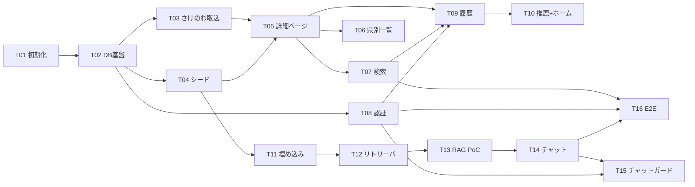

# タスク一覧（TASKS）— Jizake（日本酒レコメンドWebアプリ）

> 作成日: 2026-07-04
> 入力: `docs/DESIGN.md`（7コンポーネント・決定 D1〜D8）／`docs/REQUIREMENTS.md`（FR-01〜FR-08）／
> `docs/DATABASE.md`（10テーブル・インデックス・RLS）／`docs/DIRECTORY_STRUCTURE.md`（配置規則）／
> `docs/GIT_CONVENTIONS.md`（`feature/<ID>-<slug>`）／`docs/FEASIBILITY.md`（R3/R4 PoC 推奨）
> 前提: グリーンフィールド（既存コードなし）。自律実行モードのため、判断が必要な点は設計に沿って決定し、
> 理由を §4（分解上の判断）に記録した。

## 運用ルール

- **1タスク = 1機能 = 1ブランチ = 1PR**。ブランチ名は `feature/<ID>-<slug>`（GIT_CONVENTIONS）。
- 各タスクのマージ時点で `main` は**起動可能・テストグリーン**を保つ（未完成機能への導線は出さない／
  プレースホルダで塞ぐ）。
- 状態は `未着手` → `進行中` → `レビュー中` → `完了` で更新する。

---

## 1. タスク詳細

### T01: プロジェクト初期化（scaffold・CI・共通レイアウト）

| 項目 | 内容 |
|---|---|
| 概要 | Next.js（App Router）プロジェクトの scaffold、テスト・CI 基盤、全ページ共通レイアウトを作り、`main` を「起動可能・テストグリーン」の初期状態にする |
| 主な作業内容 | ① `git init`・`.gitignore`（`.env*` 除外）・`.env.example` ② `create-next-app`（TypeScript・Tailwind v4・`src/` 構成）＋ shadcn/ui 導入（`components.json`・`src/components/ui/`）③ Vitest（`vitest.config.ts`、E2E グロブ除外）・Playwright（`playwright.config.ts`・`e2e/` 空枠）・ESLint/typecheck の npm scripts ④ CI: `.github/workflows/ci.yml`（PR 毎に lint + typecheck + Vitest）⑤ 共通レイアウト: `src/app/layout.tsx`・`src/components/site-header.tsx`・`site-footer.tsx`（**さけのわ帰属表示＋ https://sakenowa.com リンク常設**）・`src/app/error.tsx`・`not-found.tsx`・ホーム `src/app/page.tsx`（プレースホルダ）⑥ ドメイン定数 `src/lib/constants/prefectures.ts`（JIS 47件）・`price-ranges.ts` ⑦ Vercel プロジェクト接続（デプロイ確認） |
| 受け入れ条件 | —（全 FR の土台。非機能: シークレット非コミット・レスポンシブ・日本語 UI の基盤） |
| 依存タスク | なし |
| ブランチ | `feature/T01-project-setup` |
| 状態 | 未着手 |

### T02: DB 基盤（Supabase・Drizzle スキーマ 10 テーブル・RLS）

| 項目 | 内容 |
|---|---|
| 概要 | Supabase プロジェクトを作成し、DATABASE.md の物理設計（10テーブル・インデックス・RLS・トリガ）をマイグレーションとして再現可能にする |
| 主な作業内容 | ① Supabase プロジェクト作成・接続情報を `.env.example` へ反映 ② `src/lib/db/schema.ts`（breweries / sakes / tags / sake_tags / profiles / view_histories / search_histories / chat_sessions / chat_messages / sake_embeddings。型の単一情報源）③ `src/lib/db/client.ts` ④ `drizzle.config.ts`・drizzle-kit で `drizzle/` に SQL 生成 ⑤ カスタム SQL マイグレーション: `CREATE EXTENSION vector`・RLS 有効化＋ポリシー（DATABASE §4.2）・`profiles` 自動作成トリガ・HNSW インデックス ⑥ DATABASE §3 のインデックス一式 ⑦ `.github/workflows/ping-supabase.yml`（無料枠 7 日停止対策の定期 ping） |
| 受け入れ条件 | FR-01（DB 格納の受け皿）、非機能「履歴は本人のみ参照可能」（RLS 二段目） |
| 依存タスク | T01 |
| ブランチ | `feature/T02-db-schema` |
| 状態 | 未着手 |

### T03: さけのわデータインポート

| 項目 | 内容 |
|---|---|
| 概要 | さけのわ API から蔵元・銘柄・ランキング・フレーバーを取得し、冪等 upsert で DB に投入する（味タグの機械付与を含む） |
| 主な作業内容 | ① `scripts/lib/sakenowa/client.ts`（areas / brands / breweries / rankings / flavor-charts / brand-flavor-tags 取得）② `scripts/lib/sakenowa/schemas.ts`（レスポンスの Zod 検証）③ `scripts/lib/sakenowa/flavor-to-tags.ts`（6軸→味タグ変換の純関数。しきい値は定数）＋ `flavor-to-tags.test.ts`・`fixtures/` ④ `scripts/import-sakenowa.ts`（`sakenowa_brand_id` / `sakenowa_brewery_id` を競合キーに冪等 upsert。`sake_tags` は `source='sakenowa'` のみ入れ替え、`manual` を保全）⑤ `package.json` に `import:sakenowa` script ⑥ 冪等性テスト（2 回実行で同一状態） |
| 受け入れ条件 | FR-01（データ投入が再実行可能）、FR-02（タグ付与） |
| 依存タスク | T02 |
| ブランチ | `feature/T03-import-sakenowa` |
| 状態 | 未着手 |

### T04: 手作業シードデータ投入

| 項目 | 内容 |
|---|---|
| 概要 | 自作説明文・種別タグ・読み仮名・公式 URL・価格帯を `seed-data/` に整備し、冪等 upsert で投入する（RAG・詳細ページの実データ源） |
| 主な作業内容 | ① `seed-data/` に JSON/TS でデータ整備（説明文は必ず自作＝著作権 R2。PoC を見据え**説明文つき銘柄を 50 件以上**用意）② `scripts/seed.ts`（`UNIQUE (brewery_id, name)` / `tags.name` を競合キーに冪等 upsert。種別タグは `source='manual'`）③ `package.json` に `seed` script ④ 冪等性テスト |
| 受け入れ条件 | FR-01（名称・蔵元・都道府県・説明文の充足、再実行可能な投入手順） |
| 依存タスク | T02（T03 と並行可） |
| ブランチ | `feature/T04-seed-data` |
| 状態 | 未着手 |

### T05: 日本酒詳細ページ

| 項目 | 内容 |
|---|---|
| 概要 | `/sake/[id]` で説明・タグ一覧・外部リンク・価格帯を表示する（カタログの最初の縦スライス） |
| 主な作業内容 | ① `src/lib/db/queries/sakes.ts`（詳細取得・`SakeSummary` 型。横断クエリ）② `src/app/sake/[id]/page.tsx`（RSC 直接クエリ、`revalidate = 3600`）③ `src/app/sake/[id]/_components/`（タグ一覧・外部リンク: `target="_blank" rel="noopener"`、`official_url`/`amazon_url` 欠損時は Amazon 検索 URL 生成 or 非表示、価格帯表示）④ `src/components/sake-card.tsx`（銘柄カード。以降の一覧・推薦・チャットで共用）⑤ 存在しない ID は `not-found` |
| 受け入れ条件 | FR-01（詳細が取得・表示できる）、FR-02（詳細でタグ一覧表示）、FR-03（全条件） |
| 依存タスク | T03, T04（表示する実データ） |
| ブランチ | `feature/T05-sake-detail` |
| 状態 | 未着手 |

### T06: 都道府県別地酒一覧

| 項目 | 内容 |
|---|---|
| 概要 | 都道府県の選択 UI から `/prefectures/[code]` の地酒一覧に到達し、カードから詳細へ遷移できる |
| 主な作業内容 | ① `src/lib/db/queries/sakes.ts` に県別一覧クエリ追加（蔵元 JOIN、ページネーション 24 件/頁）② `src/app/prefectures/[code]/page.tsx`（`revalidate = 3600`）③ 都道府県選択 UI（リスト形式。`src/lib/constants/prefectures.ts` 参照）をホームまたは同セグメント `_components/` に配置 ④ 不正コードは `not-found` |
| 受け入れ条件 | FR-07（選択 UI から一覧に到達） |
| 依存タスク | T05（sake-card・クエリ基盤）。T07 と並行可 |
| ブランチ | `feature/T06-prefectures` |
| 状態 | 未着手 |

### T07: 検索機能

| 項目 | 内容 |
|---|---|
| 概要 | 名前（部分一致）× 都道府県 × 味タグの複合検索。URL クエリパラメータ駆動（決定 D7）で結果一覧→詳細へ遷移できる |
| 主な作業内容 | ① `src/app/search/_lib/build-search-query.ts`（URL パラメータ→検索条件の純関数、Zod で `SearchParams` に正規化）＋ `build-search-query.test.ts` ② `src/app/search/_lib/search-sakes.ts`（`name ILIKE` + `reading ILIKE`・蔵元 JOIN・タグ EXISTS の AND 結合、ページネーション）③ `src/app/search/page.tsx`（SSR）④ `src/app/search/_components/`（検索フォーム・結果一覧・**0件時の空状態＋条件緩和導線**）⑤ タグ一覧クエリ `src/lib/db/queries/tags.ts` |
| 受け入れ条件 | FR-06（全条件）、FR-02（タグをキーに絞り込める） |
| 依存タスク | T05。T06 と並行可 |
| ブランチ | `feature/T07-search` |
| 状態 | 未着手 |

### T08: 認証（サインアップ・ログイン・ログアウト）

| 項目 | 内容 |
|---|---|
| 概要 | Supabase Auth（メール＋パスワード）でサインアップ／ログイン／ログアウトでき、セッションが維持される |
| 主な作業内容 | ① `src/lib/auth/server.ts`・`client.ts`・`session.ts`（`@supabase/ssr` 標準パターン。supabase-js の型をここで閉じる）② `src/lib/auth/actions.ts`（signUp / signIn / signOut、Zod 入力検証）③ `src/app/login/page.tsx`・`src/app/signup/page.tsx`（`?next=` リダイレクト対応）④ `src/middleware.ts`（`updateSession`。`/history` ガードは T09 で有効化）⑤ `src/components/site-header.tsx` にログイン状態表示・ログアウト導線 |
| 受け入れ条件 | FR-04（サインアップ／ログイン／ログアウト） |
| 依存タスク | T02（profiles トリガ）、T01。T05〜T07 と並行可 |
| ブランチ | `feature/T08-auth` |
| 状態 | 未着手 |

### T09: 履歴記録と履歴画面

| 項目 | 内容 |
|---|---|
| 概要 | 詳細閲覧・検索実行を Server Action で記録し、本人だけが `/history` で参照できる |
| 主な作業内容 | ① `src/app/sake/[id]/_actions/record-view.ts`・`src/app/sake/[id]/_components/` に記録トリガ Client Component（マウント時 fire-and-forget、未ログインは no-op、失敗は表示に影響させない）② `src/app/search/_actions/record-search.ts`（`filters` jsonb に条件スナップショット。0 件検索も記録）③ `src/app/history/page.tsx`・`_lib/queries.ts`（**user_id を引数で受けず認証セッションから強制**＝主防御）④ `src/middleware.ts` の `/history` ガード（未ログイン→`/login?next=/history`） |
| 受け入れ条件 | FR-05（閲覧・検索が履歴として記録される）、FR-04（未ログインで履歴アクセス時に誘導） |
| 依存タスク | T05, T07, T08 |
| ブランチ | `feature/T09-history` |
| 状態 | 未着手 |

### T10: 履歴ベース推薦エンジン＋ホーム画面表示

| 項目 | 内容 |
|---|---|
| 概要 | ルールベース推薦エンジン（固定 IF・差し替え可能）を実装し、ホームに推薦カード列を表示する縦スライス |
| 主な作業内容 | ① `src/lib/recommend/types.ts`（`recommend(input)` の固定 IF・`RecommendedSake`/`RecommendReason`）② `src/lib/recommend/rule-based.ts`（直近履歴のタグ＋都道府県〔擬似タグ〕頻度を時間減衰つきで集計する単一 SQL → 未閲覧銘柄をタグ一致度でスコアリング）③ `src/lib/recommend/scoring.ts`（スコア計算の純関数、重み定数を注入可能に）＋ `scoring.test.ts` ④ コールドスタート: 履歴 3 件未満・未ログインは `popularity_rank` 上位＋ランダム性のフォールバック（reason: "人気の銘柄"）⑤ `src/lib/recommend/index.ts`（実装の選択）⑥ `src/app/page.tsx`・`_components/` で推薦カード列＋ reason 表示。未ログイン時はログイン誘導を併記 |
| 受け入れ条件 | FR-05（ホームに履歴ベースのおすすめ表示＋フォールバック） |
| 依存タスク | T09（履歴データ）、T05（sake-card） |
| ブランチ | `feature/T10-recommend-home` |
| 状態 | 未着手 |

### T11: 埋め込みパイプライン

| 項目 | 内容 |
|---|---|
| 概要 | 説明文の埋め込みを差分生成して `sake_embeddings` に upsert する（RAG の知識源整備） |
| 主な作業内容 | ① `src/lib/ai/models.ts`（AI Gateway 経由のモデル ID 定数）・`src/lib/ai/embedding.ts`（`embedText(text)`。Web とバッチで共用、AI SDK の import はここに集約）② `scripts/embed.ts`（description の SHA-256 を `source_hash` と比較し**変更行のみ再埋め込み**、`model` 列で差し替え時の再生成判定）③ `package.json` に `embed` script ④ 差分判定ロジックのユニットテスト |
| 受け入れ条件 | FR-08 の基盤（知識源の埋め込み） |
| 依存タスク | T04（説明文）。T05〜T10 と並行可 |
| ブランチ | `feature/T11-embedding-pipeline` |
| 状態 | 未着手 |

### T12: RAG リトリーバ＋捏造防止検証

| 項目 | 内容 |
|---|---|
| 概要 | LLM 非依存のハイブリッド検索（SQL 絞り込み＋ pgvector 類似度）と、提案 ID の DB 存在検証を実装する |
| 主な作業内容 | ① `src/lib/rag/retriever.ts`（`retrieveSakeCandidates()`: タグ・都道府県・価格帯の SQL 絞り込み＋ `<=>` コサイン類似度。必ず実在 sakeId を含む候補を返す、候補上限は定数〔初期 8 件〕）② `retriever.test.ts`（テスト DB での統合テスト）③ `src/lib/rag/validate-proposed.ts`（`validateProposedSakeIds()`: 実在 ID のみ返す）＋ `validate-proposed.test.ts` |
| 受け入れ条件 | FR-08（提案は DB 実在の銘柄のみ＝捏造防止の一段目・二段目の部品） |
| 依存タスク | T11 |
| ブランチ | `feature/T12-rag-retriever` |
| 状態 | 未着手 |

### T13: RAG 精度 PoC（FEASIBILITY R3/R4）

| 項目 | 内容 |
|---|---|
| 概要 | 銘柄 50 件×質問 10 パターンで「埋め込み検索の精度」と「ヒアリング→検索条件変換の品質」「structured output＋ID 検証による捏造防止」を検証し、retriever の重み・プロンプト方針を確定する |
| 主な作業内容 | ① 質問 10 パターンと期待銘柄の評価セット作成 ② retriever 単体の精度計測（意図した銘柄が上位に来るか）③ Claude Haiku 4.5 ＋ `searchSake`/`proposeSake` ツール案でヒアリング→条件変換→提案の 1 往復を試行し、捏造が ID 検証で落ちることを確認 ④ 結果と調整（retriever の重み・`src/lib/ai/prompts.ts` の初版システムプロンプト）を `docs/FEASIBILITY.md` 追記または `docs/` 配下の PoC 記録として残す ⑤ 検証スクリプトは使い捨てとし `main` のビルド対象に含めない |
| 受け入れ条件 | FR-08（品質リスク R3/R4 の解消。受け入れ条件を満たせる見込みの確定） |
| 依存タスク | T12 |
| ブランチ | `feature/T13-rag-poc` |
| 状態 | 未着手 |

### T14: RAG チャットボット（UI＋API）

| 項目 | 内容 |
|---|---|
| 概要 | `/chat` の Q&A ヒアリング→複数銘柄提案の縦スライス。ストリーミング応答と検証済みカード表示 |
| 主な作業内容 | ① `src/app/api/chat/route.ts`（唯一の Route Handler。Zod 入力検証→`streamText`〔AI Gateway 経由 Claude Haiku 4.5〕→`proposeSake` の ID を **DB 存在検証してからデータパートで送信**。実在しない ID は黙って除外）② `src/app/api/chat/_lib/tools.ts`（`searchSake`: retriever 呼び出し／`proposeSake`: Zod structured output）③ `src/lib/ai/prompts.ts`（T13 で確定したシステムプロンプト: ヒアリング 2〜3 問→検索→提案、検索結果内の銘柄のみ提案）④ `src/app/chat/page.tsx`・`_components/`（`useChat` ストリーミング表示・提案カード〔`/sake/[id]` リンク付き、sake-card 共用〕・LLM 応答はプレーンテキスト表示）⑤ generator のユニットテストは `src/lib/ai` アダプタの固定応答モックで（実 API は叩かない） |
| 受け入れ条件 | FR-08（チャットで質問→回答→複数提案、提案は実在銘柄＋詳細リンク、捏造しない） |
| 依存タスク | T12, T13 |
| ブランチ | `feature/T14-chat` |
| 状態 | 未着手 |

### T15: チャット運用ガード（コスト上限・フォールバック・セッション保存）

| 項目 | 内容 |
|---|---|
| 概要 | チャットのコスト・障害・永続化の運用面を仕上げる（DESIGN §6.3・§6.4・決定 D4） |
| 主な作業内容 | ① コスト上限ガード: 往復数上限（初期 10）・メッセージ長上限・`maxOutputTokens` を定数化、超過時は検索ページ誘導を返す ② ログインユーザーのレート制限（DB カウントで 20 会話/日。`chat_sessions` の index 8 を利用）③ LLM 障害時フォールバック: タイムアウト（30 秒）→エラーパート→UI で「混み合っています」＋ヒアリング内容から組み立てた検索 URL 導線 ④ ログインユーザーの確定提案のみ `chat_sessions`/`chat_messages` へ保存（`proposed_sake_ids` は検証済み ID のみ、匿名は保存しない） |
| 受け入れ条件 | FR-08（安定運用）、非機能（コスト・可用性） |
| 依存タスク | T14, T08 |
| ブランチ | `feature/T15-chat-guards` |
| 状態 | 未着手 |

### T16: E2E テスト整備（主要 3 導線）

| 項目 | 内容 |
|---|---|
| 概要 | 主要導線の Playwright E2E を整備し、CI に組み込む（TEST_PHILOSOPHY: E2E は 3 導線のみ） |
| 主な作業内容 | ① `e2e/search-flow.spec.ts`（検索→一覧→詳細）② `e2e/auth.spec.ts`（サインアップ・ログイン）③ `e2e/chat.spec.ts`（チャット 1 往復。LLM はモックエンドポイント）④ `.github/workflows/ci.yml` に Playwright ジョブ追加 |
| 受け入れ条件 | FR-04 / FR-06 / FR-08 の導線の回帰保証（横断） |
| 依存タスク | T07, T08, T14 |
| ブランチ | `feature/T16-e2e` |
| 状態 | 未着手 |

---

## 2. 実装順序と依存グラフ

各タスクのマージ時点で `main` が起動可能・テストグリーンに保てる順序。

**直列の基本順**: T01 → T02 → T03 → T04 → T05 → T06 → T07 → T08 → T09 → T10 → T11 → T12 → T13 → T14 → T15 → T16

**並行可能な組**（1人開発でも PR を分けたまま前後入れ替え可）:

- T03 ∥ T04（ともに T02 のみに依存。書き込みキーが別）
- T06 ∥ T07（ともに T05 のみに依存）
- T08 は T05〜T07 と並行可（T02 完了後いつでも）
- T11 → T12 の列は T04 完了後、T05〜T10 と並行可

データインポート（T03・T04）を最前段に置くのは「データが無いと画面が作れない」ため。
T05 以降の画面タスクは常に実データで動作確認できる。

---

## 3. 受け入れ条件カバレッジ対応表

REQUIREMENTS.md の全受け入れ条件がいずれかのタスクでカバーされることの確認。

| FR | 受け入れ条件 | 担当タスク |
|---|---|---|
| FR-01 | 日本酒データが DB に格納され、一覧・詳細（サーバ側データ取得＋ページ、DESIGN §5.1 の解釈）で取得できる | T02（スキーマ）＋ T03/T04（投入）＋ T05（詳細）＋ T06/T07（一覧） |
| FR-01 | データ投入（シード/インポート）が再実行可能な手順として整備されている | T03（冪等 upsert＋npm script）＋ T04（同） |
| FR-02 | 日本酒詳細でタグ一覧が表示される | T05 |
| FR-02 | タグをキーに日本酒を絞り込める | T07（タグ条件検索）※タグ付与自体は T03/T04 |
| FR-03 | `/sake/[id]` 形式の URL で詳細ページへ直接アクセスできる | T05 |
| FR-03 | 外部リンクは別タブで開き、リンクが無い場合は非表示になる | T05 |
| FR-04 | メール等でサインアップ／ログイン／ログアウトできる | T08 |
| FR-04 | 未ログインで履歴・パーソナライズ推薦にアクセスすると誘導される | T09（/history ガード）＋ T10（ホーム推薦枠のログイン誘導） |
| FR-05 | 詳細ページ閲覧と検索実行が履歴として記録される | T09 |
| FR-05 | ホーム画面に履歴に基づくおすすめが表示される（無履歴時はフォールバック） | T10 |
| FR-06 | 名前・都道府県・味の各条件および組み合わせで検索できる | T07 |
| FR-06 | 結果一覧のカードから詳細ページに遷移できる | T07（＋ T05 の sake-card） |
| FR-06 | 該当 0 件の場合は空状態メッセージが表示される | T07 |
| FR-07 | 都道府県の選択 UI（マップまたはリスト）から一覧に到達できる | T06 |
| FR-08 | チャット UI で質問→回答のやり取りができ、最終的に日本酒が複数提案される | T14（品質担保: T13、基盤: T11/T12、安定運用: T15） |
| FR-08 | 提案はアプリ内 DB に存在する日本酒であり、詳細ページへのリンクを持つ | T12（ID 検証部品）＋ T14（サーバ側検証＋カードリンク） |
| FR-08 | DB に無い銘柄を捏造して提案しない（RAG の検索結果に基づく） | T12＋T13（PoC で確認）＋T14（二段構えの実装） |

取りこぼし・どの受け入れ条件にも紐づかないタスクなし（T01・T02・T16 は全 FR の土台／回帰保証、
T11 は FR-08 の基盤として明示的に紐づく）。

---

## 4. 分解上の判断（自律実行モードでの決定と理由）

| # | 判断 | 理由 |
|---|---|---|
| TK-1 | プロジェクト初期化（T01）と DB 基盤（T02）を分離 | scaffold＋CI と Supabase＋10テーブルはそれぞれ単体でレビュー可能な PR サイズであり、1 つに詰めると粒度過大。T01 マージ時点で `main` は空アプリとして起動可能 |
| TK-2 | データインポートを T03（さけのわ）と T04（シード）に分割 | データソース 1 つ＝スクリプト 1 本＋`scripts/lib/<source>/`（DIRECTORY_STRUCTURE 例4 と同型）。冪等 upsert キーも別で、独立に検証できる。画面より先に置き、以降の全画面タスクを実データで確認可能にする |
| TK-3 | RAG を T11（埋め込み）／T12（リトリーバ）／T13（PoC）／T14（チャットUI＋API）／T15（運用ガード）に分割 | DESIGN §2.6 の retriever/generator 分離をそのままタスク境界にした。T12 は LLM 非依存で単体マージ可能。PoC（FEASIBILITY R3/R4 推奨）は retriever 完成後・チャット実装前に置き、プロンプト・重みを確定してから T14 に入る。T15（レート制限・フォールバック・保存）を分けたのは、T14 だけで FR-08 の受け入れ条件を満たし `main` が壊れないため |
| TK-4 | 履歴ベース推薦は T10 で「エンジン＋ホーム表示」の 1 縦スライス | エンジン単体では画面価値がなく、ホーム表示単体ではロジックがない。固定 IF（`src/lib/recommend/types.ts`）〜カード表示までで FR-05 後半の受け入れ条件を 1 PR で満たす |
| TK-5 | 履歴記録と履歴画面を T09 で 1 タスクに | 記録（Server Actions）だけでは受け入れ確認手段がなく、画面（/history）だけでは表示対象がない。記録→参照で 1 つの完結した機能パス |
| TK-6 | E2E を T16 として最後に分離 | E2E は機能横断で単一の持ち主がいない（DIRECTORY_STRUCTURE 決定 DIR-5）。3 導線（検索・認証・チャット）が全部揃う T14 以降でのみ書ける |
| TK-7 | T13 PoC の成果物はドキュメント＋定数調整のみ | PoC スクリプトを `main` の恒久コードにしない（使い捨てスパイク）。確定した知見はプロンプト定数・retriever 重み・docs への追記として残す |
